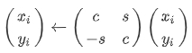
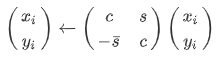
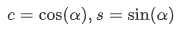
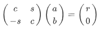
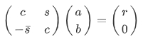
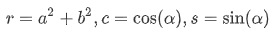
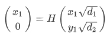

# BLAS笔记

**BLAS**是Basic Linear Algebra Subprograms的缩写，即基本线性代数子程序，简介可以参考：[Wiki BLAS](https://en.wikipedia.org/wiki/Basic_Linear_Algebra_Subprograms)。它的函数分成3个levels，即

- **Level1** (vector - vector)，计算y的线性代数表达式为：
  $$y \leftarrow \alpha x + y$$
- **Level2** (matrix - vector)，计算y的线性代数表达式为：
  $$y \leftarrow \alpha A x + \beta y$$
  或者求解x向量
  $$T x = y$$
- **Level3** (matrix - matrix)，线性代数表达式为：
  $$C \leftarrow \alpha AB + \beta C$$

BLAS有很多实现方案，常见的如下所示

- CPU
  - Intel MKL (Only Intel CPU)
  - Netlib BLAS (Fortran77语言实现)
  - Netlib CBLAS (C语言实现)
  - GSL (GNU Scientific Libaray, 实现CBLAS接口)
  - OpenBLAS
  - LAPACK (Fortran77语言实现)
  - uBLAS (boost库的一部分)
  - Eigen BLAS (Fortran77与C语言的实现)
- GPU
  - cuBLAS (Only NVIDIA GPU)
  - rocBLAS (Only AMD GPU)
  - clBLAS (OpenCL BLAS实现，AMD主导)
  - clBLAST (tuned OpenCL BLAS实现)

对于CPU的BLAS方案，最常使用的是Intel MKL与OpenBLAS；GPU的BLAS方案，最常用的是cuBLAS（NVIDIA GPU）与clBLAST。clBLAS已经基本上停止维护，性能不佳，一般考虑使用clBLAST方案。

BLAS APIs的定义可以参考[netlib官网](http://www.netlib.org/blas/)，对于BLAS函数的前缀，比如S/D/C/Z，与后缀U/C等进行了说明，详见：https://www.gnu.org/software/gsl/doc/html/blas.html

| 前缀 | 说明                   |
| ---- | ---------------------- |
| S    | 单精度                 |
| D    | 双精度                 |
| C    | 单精度复数             |
| Z    | 双精度复数             |
| DS   | 输入单精度，输出双精度 |

| 后缀 | 说明                                   |
| ---- | -------------------------------------- |
| C    | 复数计算，做向量共轭（conjugated）     |
| U    | 复数计算，不做向量共轭（unconjugated） |

例子

sdot：实数单精度dot计算

ddot：实数双精度dot计算

dsdot：输入单精度实数，输出双精度实数的dot计算

cdotc：单精度复数计算，并对第一个输入当精度向量进行共轭计算

cdotu：单精度复数计算，无向量共轭计算

zdotc：双精度复数计算，并对第一个输入双精度向量进行共轭计算

zdotu：双精度复数计算，无向量共轭计算

| 常见操作 | 说明                           |
| -------- | :----------------------------- |
| **DOT**  | scalar product, $x^T y$      |
| **AXPY** | vector sum, $ax + y$           |
| **MV**   | matrix-vector product,$Ax$     |
| **SV**   | matrix-vector solve, $A^{-1}x$ |
| **MM**   | matrix-matrix product, $AB$    |
| **SM**   | matrix-matrix solve, $A^{-1}B$ |

| 常见缩写 | 说明                       |
| -------- | :------------------------- |
| **GE**   | general                    |
| **GB**   | general band               |
| **SY**   | symmetric                  |
| **SB**   | symmetric band (对称带状)  |
| **SP**   | symmetric packed(对称包装) |
| **HE**   | hermitian(赫米特)          |
| **HB**   | hermitian band             |
| **HP**   | hermitian packed           |
| **TR**   | triangular                 |
| **TB**   | triangular band            |
| **TP**   | triangular packed          |

对于包装的内存存储格式主要是为了节省内存，比如说

| UPLO | Triangular matrix ***A\***                                   | Packed storage in array AP                                   |
| ---- | ------------------------------------------------------------ | ------------------------------------------------------------ |
| `U'  |  |  |
| `L'  |  |  |

## BLAS APIs

| Level  | 函数名                | CLBlast | OpenBLAS | cuBLAS | clBLAS | GSL BLAS |
| ------ | --------------------- | ------- | -------- | ------ | ------ | -------- |
| Level1 | srotg                 | ×       | √        | √      | √      | √        |
| Level1 | drotg                 | ×       | √        | √      | √      | √        |
| Level1 | crotg                 | ×       | √        | √      | √      | ×        |
| Level1 | zrotg                 | ×       | √        | √      | √      | ×        |
| Level1 | srotmg                | ×       | √        | √      | √      | √        |
| Level1 | drotmg                | ×       | √        | √      | √      | √        |
| Level1 | srot                  | ×       | √        | √      | √      | √        |
| Level1 | drot                  | ×       | √        | √      | √      | √        |
| Level1 | crot                  | ×       | ×        | √      | ×      | ×        |
| Level1 | zrot                  | ×       | ×        | √      | ×      | ×        |
| Level1 | csrot                 | ×       | √        | √      | √      | ×        |
| Level1 | zdrot                 | ×       | √        | √      | √      | ×        |
| Level1 | srotm                 | ×       | √        | √      | √      | √        |
| Level1 | drotm                 | ×       | √        | √      | √      | √        |
| Level1 | sswap                 | √       | √        | √      | √      | √        |
| Level1 | dswap                 | √       | √        | √      | √      | √        |
| Level1 | cswap                 | √       | √        | √      | √      | √        |
| Level1 | zswap                 | √       | √        | √      | √      | √        |
| Level1 | hswap                 | √       | ×        | ×      | ×      | ×        |
| Level1 | sscal                 | √       | √        | √      | √      | √        |
| Level1 | dscal                 | √       | √        | √      | √      | √        |
| Level1 | cscal                 | √       | √        | √      | √      | √        |
| Level1 | zscal                 | √       | √        | √      | √      | √        |
| Level1 | hscal                 | √       | ×        | ×      | ×      | ×        |
| Level1 | csscal                | ×       | √        | √      | √      | √        |
| Level1 | zdscal                | ×       | √        | √      | √      | √        |
| Level1 | scopy                 | √       | √        | √      | √      | √        |
| Level1 | dcopy                 | √       | √        | √      | √      | √        |
| Level1 | ccopy                 | √       | √        | √      | √      | √        |
| Level1 | zcopy                 | √       | √        | √      | √      | √        |
| Level1 | hcopy                 | √       | ×        | ×      | ×      | ×        |
| Level1 | saxpy                 | √       | √        | √      | √      | √        |
| Level1 | daxpy                 | √       | √        | √      | √      | √        |
| Level1 | caxpy                 | √       | √        | √      | √      | √        |
| Level1 | zaxpy                 | √       | √        | √      | √      | √        |
| Level1 | haxpy                 | √       | ×        | ×      | ×      | ×        |
| Level1 | dsdot                 | ×       | √        | ×      | ×      | √        |
| Level1 | sdsdot                | ×       | √        | ×      | ×      | √        |
| Level1 | sdot                  | √       | √        | √      | √      | √        |
| Level1 | ddot                  | √       | √        | √      | √      | √        |
| Level1 | hdot                  | √       | ×        | ×      | ×      | ×        |
| Level1 | cdotu                 | √       | √        | √      | √      | ×        |
| Level1 | zdotu                 | √       | √        | √      | √      | ×        |
| Level1 | cdotc                 | √       | √        | √      | √      | ×        |
| Level1 | zdotc                 | √       | √        | √      | √      | ×        |
| Level1 | cdotu_sub             | ×       | √        | ×      | ×      | √        |
| Level1 | cdotc_sub             | ×       | √        | ×      | ×      | √        |
| Level1 | zdotu_sub             | ×       | √        | ×      | ×      | √        |
| Level1 | zdotc_sub             | ×       | √        | ×      | ×      | √        |
| Level1 | snrm2                 | √       | √        | √      | √      | √        |
| Level1 | dnrm2                 | √       | √        | √      | √      | √        |
| Level1 | scnrm2                | √       | √        | √      | √      | √        |
| Level1 | dznrm2                | √       | √        | √      | √      | √        |
| Level1 | hnrm2                 | √       | ×        | ×      | ×      | ×        |
| Level1 | sasum                 | √       | √        | √      | √      | √        |
| Level1 | dasum                 | √       | √        | √      | √      | √        |
| Level1 | scasum                | √       | √        | √      | √      | √        |
| Level1 | dzasum                | √       | √        | √      | √      | √        |
| Level1 | hasum                 | √       | ×        | ×      | ×      | ×        |
| Level1 | ssum                  | √       | √        | ×      | ×      | ×        |
| Level1 | dsum                  | √       | √        | ×      | ×      | ×        |
| Level1 | scsum                 | √       | √        | ×      | ×      | ×        |
| Level1 | dzsum                 | √       | √        | ×      | ×      | ×        |
| Level1 | hsum                  | √       | ×        | ×      | ×      | ×        |
| Level1 | samax                 | ×       | ×        | ×      | √      | ×        |
| Level1 | damax                 | ×       | ×        | ×      | √      | ×        |
| Level1 | scamax                | ×       | ×        | ×      | √      | ×        |
| Level1 | dzamax                | ×       | ×        | ×      | √      | ×        |
| Level1 | isamax                | √       | √        | √      | √      | √        |
| Level1 | idamax                | √       | √        | √      | √      | √        |
| Level1 | icamax                | √       | √        | √      | √      | √        |
| Level1 | izamax                | √       | √        | √      | √      | √        |
| Level1 | ihamax                | √       | ×        | ×      | ×      | ×        |
| Level1 | samin                 | ×       | ×        | ×      | ×      | ×        |
| Level1 | damin                 | ×       | ×        | ×      | ×      | ×        |
| Level1 | camin                 | ×       | ×        | ×      | ×      | ×        |
| Level1 | zamin                 | ×       | ×        | ×      | ×      | ×        |
| Level1 | isamin                | √       | √        | √      | ×      | ×        |
| Level1 | idamin                | √       | √        | √      | ×      | ×        |
| Level1 | icamin                | √       | √        | √      | ×      | ×        |
| Level1 | izamin                | √       | √        | √      | ×      | ×        |
| Level1 | ihamin                | √       | ×        | ×      | ×      | ×        |
| Level1 | smax                  | ×       | ×        | ×      | ×      | ×        |
| Level1 | dmax                  | ×       | ×        | ×      | ×      | ×        |
| Level1 | cmax                  | ×       | ×        | ×      | ×      | ×        |
| Level1 | zmax                  | ×       | ×        | ×      | ×      | ×        |
| Level1 | ismax                 | √       | √        | ×      | ×      | ×        |
| Level1 | idmax                 | √       | √        | ×      | ×      | ×        |
| Level1 | icmax                 | √       | √        | ×      | ×      | ×        |
| Level1 | izmax                 | √       | √        | ×      | ×      | ×        |
| Level1 | ihmax                 | √       | ×        | ×      | ×      | ×        |
| Level1 | smin                  | ×       | ×        | ×      | ×      | ×        |
| Level1 | dmin                  | ×       | ×        | ×      | ×      | ×        |
| Level1 | cmin                  | ×       | ×        | ×      | ×      | ×        |
| Level1 | zmin                  | ×       | ×        | ×      | ×      | ×        |
| Level1 | ismin                 | √       | √        | ×      | ×      | ×        |
| Level1 | idmin                 | √       | √        | ×      | ×      | ×        |
| Level1 | icmin                 | √       | √        | ×      | ×      | ×        |
| Level1 | izmin                 | √       | √        | ×      | ×      | ×        |
| Level1 | ihmin                 | √       | ×        | ×      | ×      | ×        |
| Level2 | sgemv                 | √       | √        | √      | √      | √        |
| Level2 | dgemv                 | √       | √        | √      | √      | √        |
| Level2 | cgemv                 | √       | √        | √      | √      | √        |
| Level2 | zgemv                 | √       | √        | √      | √      | √        |
| Level2 | hgemv                 | √       | ×        | ×      | ×      | ×        |
| Level2 | sgbmv                 | √       | √        | √      | √      | √        |
| Level2 | dgbmv                 | √       | √        | √      | √      | √        |
| Level2 | cgbmv                 | √       | √        | √      | √      | √        |
| Level2 | zgbmv                 | √       | √        | √      | √      | √        |
| Level2 | hgbmv                 | √       | ×        | ×      | ×      | ×        |
| Level2 | chemv                 | √       | √        | √      | √      | √        |
| Level2 | zhemv                 | √       | √        | √      | √      | √        |
| Level2 | chbmv                 | √       | √        | √      | √      | √        |
| Level2 | zhbmv                 | √       | √        | √      | √      | √        |
| Level2 | chpmv                 | √       | √        | √      | √      | √        |
| Level2 | zhpmv                 | √       | √        | √      | √      | √        |
| Level2 | ssymv                 | √       | √        | √      | √      | √        |
| Level2 | dsymv                 | √       | √        | √      | √      | √        |
| Level2 | csymv                 | ×       | ×        | √      | √      | ×        |
| Level2 | zsymv                 | ×       | ×        | √      | √      | ×        |
| Level2 | hsymv                 | √       | ×        | ×      | ×      | ×        |
| Level2 | ssbmv                 | √       | √        | √      | √      | √        |
| Level2 | dsbmv                 | √       | √        | √      | √      | √        |
| Level2 | hsbmv                 | √       | ×        | ×      | ×      | ×        |
| Level2 | sspmv                 | √       | √        | √      | √      | √        |
| Level2 | dspmv                 | √       | √        | √      | √      | √        |
| Level2 | hspmv                 | √       | ×        | ×      | ×      | ×        |
| Level2 | strmv                 | √       | √        | √      | √      | √        |
| Level2 | dtrmv                 | √       | √        | √      | √      | √        |
| Level2 | ctrmv                 | √       | √        | √      | √      | √        |
| Level2 | ztrmv                 | √       | √        | √      | √      | √        |
| Level2 | htrmv                 | √       | ×        | √      | ×      | ×        |
| Level2 | stbmv                 | √       | √        | √      | √      | √        |
| Level2 | dtbmv                 | √       | √        | √      | √      | √        |
| Level2 | ctbmv                 | √       | √        | √      | √      | √        |
| Level2 | ztbmv                 | √       | √        | √      | √      | √        |
| Level2 | htbmv                 | √       | ×        | ×      | ×      | ×        |
| Level2 | stpmv                 | √       | √        | √      | √      | √        |
| Level2 | dtpmv                 | √       | √        | √      | √      | √        |
| Level2 | ctpmv                 | √       | √        | √      | √      | √        |
| Level2 | ztpmv                 | √       | √        | √      | √      | √        |
| Level2 | htpmv                 | √       | ×        | ×      | ×      | ×        |
| Level2 | strsv                 | √       | √        | √      | √      | √        |
| Level2 | dtrsv                 | √       | √        | √      | √      | √        |
| Level2 | ctrsv                 | √       | √        | √      | √      | √        |
| Level2 | ztrsv                 | √       | √        | √      | √      | √        |
| Level2 | stbsv                 | √       | √        | ×      | √      | √        |
| Level2 | dtbsv                 | √       | √        | ×      | √      | √        |
| Level2 | ctbsv                 | √       | √        | ×      | √      | √        |
| Level2 | ztbsv                 | √       | √        | ×      | √      | √        |
| Level2 | stpsv                 | √       | √        | √      | √      | √        |
| Level2 | dtpsv                 | √       | √        | √      | √      | √        |
| Level2 | ctpsv                 | √       | √        | √      | √      | √        |
| Level2 | ztpsv                 | √       | √        | √      | √      | √        |
| Level2 | sger                  | √       | √        | √      | √      | √        |
| Level2 | dger                  | √       | √        | √      | √      | √        |
| Level2 | hger                  | √       | ×        | ×      | ×      | ×        |
| Level2 | cgeru                 | √       | √        | √      | √      | √        |
| Level2 | zgeru                 | √       | √        | √      | √      | √        |
| Level2 | cgerc                 | √       | √        | √      | √      | √        |
| Level2 | zgerc                 | √       | √        | √      | √      | √        |
| Level2 | cher                  | √       | √        | √      | √      | √        |
| Level2 | zher                  | √       | √        | √      | √      | √        |
| Level2 | chpr                  | √       | √        | √      | √      | √        |
| Level2 | zhpr                  | √       | √        | √      | √      | √        |
| Level2 | cher2                 | √       | √        | √      | √      | √        |
| Level2 | zher2                 | √       | √        | √      | √      | √        |
| Level2 | chpr2                 | √       | √        | √      | √      | √        |
| Level2 | zhpr2                 | √       | √        | √      | √      | √        |
| Level2 | ssyr                  | √       | √        | √      | √      | √        |
| Level2 | dsyr                  | √       | √        | √      | √      | √        |
| Level2 | csyr                  | ×       | ×        | √      | ×      | ×        |
| Level2 | zsyr                  | ×       | ×        | √      | ×      | ×        |
| Level2 | hsyr                  | √       | ×        | ×      | ×      | ×        |
| Level2 | sspr                  | √       | √        | √      | √      | √        |
| Level2 | dspr                  | √       | √        | √      | √      | √        |
| Level2 | hspr                  | √       | ×        | ×      | ×      | ×        |
| Level2 | ssyr2                 | √       | √        | √      | √      | √        |
| Level2 | dsyr2                 | √       | √        | √      | √      | √        |
| Level2 | csyr2                 | ×       | ×        | √      | √      | ×        |
| Level2 | zsyr2                 | ×       | ×        | √      | √      | ×        |
| Level2 | hsyr2                 | √       | ×        | ×      | ×      | ×        |
| Level2 | sspr2                 | √       | √        | √      | √      | √        |
| Level2 | dspr2                 | √       | √        | √      | √      | √        |
| Level2 | hspr2                 | √       | ×        | ×      | ×      | ×        |
| Level2 | sgemvbatched          | ×       | ×        | √      | ×      | ×        |
| Level2 | dgemvbatched          | ×       | ×        | √      | ×      | ×        |
| Level2 | cgemvbatched          | ×       | ×        | √      | ×      | ×        |
| Level2 | zgemvbatched          | ×       | ×        | √      | ×      | ×        |
| Level2 | hshgemvbatched        | ×       | ×        | √      | ×      | ×        |
| Level2 | hssgemvbatched        | ×       | ×        | √      | ×      | ×        |
| Level2 | tstgemvbatched        | ×       | ×        | √      | ×      | ×        |
| Level2 | tssgemvbatched        | ×       | ×        | √      | ×      | ×        |
| Level2 | sgemvstridebatched    | ×       | ×        | √      | ×      | ×        |
| Level2 | dgemvstridebatched    | ×       | ×        | √      | ×      | ×        |
| Level2 | cgemvstridebatched    | ×       | ×        | √      | ×      | ×        |
| Level2 | zgemvstridebatched    | ×       | ×        | √      | ×      | ×        |
| Level2 | hshgemvstridebatched  | ×       | ×        | √      | ×      | ×        |
| Level2 | hssgemvstridebatched  | ×       | ×        | √      | ×      | ×        |
| Level2 | tstgemvstridebatched  | ×       | ×        | √      | ×      | ×        |
| Level2 | tssgemvstridebatched  | ×       | ×        | √      | ×      | ×        |
| Level3 | sgemm                 | √       | √        | √      | √      | √        |
| Level3 | dgemm                 | √       | √        | √      | √      | √        |
| Level3 | cgemm                 | √       | √        | √      | √      | √        |
| Level3 | zgemm                 | √       | √        | √      | √      | √        |
| Level3 | hgemm                 | √       | ×        | √      | ×      | ×        |
| Level3 | cgemm3m               | ×       | √        | √      | ×      | ×        |
| Level3 | zgemm3m               | ×       | √        | √      | ×      | ×        |
| Level3 | ssymm                 | √       | √        | √      | √      | √        |
| Level3 | dsymm                 | √       | √        | √      | √      | √        |
| Level3 | csymm                 | √       | √        | √      | √      | √        |
| Level3 | zsymm                 | √       | √        | √      | √      | √        |
| Level3 | hsymm                 | √       | ×        | ×      | ×      | ×        |
| Level3 | chemm                 | √       | √        | √      | √      | √        |
| Level3 | zhemm                 | √       | √        | √      | √      | √        |
| Level3 | ssyrk                 | √       | √        | √      | √      | √        |
| Level3 | dsyrk                 | √       | √        | √      | √      | √        |
| Level3 | csyrk                 | √       | √        | √      | √      | √        |
| Level3 | zsyrk                 | √       | √        | √      | √      | √        |
| Level3 | hsyrk                 | √       | ×        | ×      | ×      | ×        |
| Level3 | ssyrkx                | ×       | ×        | √      | ×      | ×        |
| Level3 | dsyrkx                | ×       | ×        | √      | ×      | ×        |
| Level3 | csyrkx                | ×       | ×        | √      | ×      | ×        |
| Level3 | zsyrkx                | ×       | ×        | √      | ×      | ×        |
| Level3 | cherk                 | √       | √        | √      | √      | √        |
| Level3 | zherk                 | √       | √        | √      | √      | √        |
| Level3 | cherkx                | ×       | ×        | √      | ×      | ×        |
| Level3 | zherkx                | ×       | ×        | √      | ×      | ×        |
| Level3 | ssyr2k                | √       | √        | √      | √      | √        |
| Level3 | dsyr2k                | √       | √        | √      | √      | √        |
| Level3 | csyr2k                | √       | √        | √      | √      | √        |
| Level3 | zsyr2k                | √       | √        | √      | √      | √        |
| Level3 | hsyr2k                | √       | ×        | ×      | ×      | ×        |
| Level3 | cher2k                | √       | √        | √      | √      | √        |
| Level3 | zher2k                | √       | √        | √      | √      | √        |
| Level3 | strmm                 | √       | √        | √      | √      | √        |
| Level3 | dtrmm                 | √       | √        | √      | √      | √        |
| Level3 | ctrmm                 | √       | √        | √      | √      | √        |
| Level3 | ztrmm                 | √       | √        | √      | √      | √        |
| Level3 | htrmm                 | √       | ×        | ×      | ×      | ×        |
| Level3 | strsm                 | √       | √        | √      | √      | √        |
| Level3 | dtrsm                 | √       | √        | √      | √      | √        |
| Level3 | ctrsm                 | √       | √        | √      | √      | √        |
| Level3 | ztrsm                 | √       | √        | √      | √      | √        |
| Level3 | strsmbatched          | ×       | ×        | √      | ×      | ×        |
| Level3 | dtrsmbatched          | ×       | ×        | √      | ×      | ×        |
| Level3 | ctrsmbatched          | ×       | ×        | √      | ×      | ×        |
| Level3 | ztrsmbatched          | ×       | ×        | √      | ×      | ×        |
| Level3 | xerbla                | ×       | √        | ×      | ×      | √        |
| Levelx | saxpby                | ×       | √        | ×      | ×      | ×        |
| Levelx | daxpby                | ×       | √        | ×      | ×      | ×        |
| Levelx | caxpby                | ×       | √        | ×      | ×      | ×        |
| Levelx | zaxpby                | ×       | √        | ×      | ×      | ×        |
| Levelx | shad                  | √       | ×        | ×      | ×      | ×        |
| Levelx | dhad                  | √       | ×        | ×      | ×      | ×        |
| Levelx | chad                  | √       | ×        | ×      | ×      | ×        |
| Levelx | zhad                  | √       | ×        | ×      | ×      | ×        |
| Levelx | somatcopy             | √       | √        | ×      | ×      | ×        |
| Levelx | domatcopy             | √       | √        | ×      | ×      | ×        |
| Levelx | comatcopy             | √       | √        | ×      | ×      | ×        |
| Levelx | zomatcopy             | √       | √        | ×      | ×      | ×        |
| Levelx | homatcopy             | √       | ×        | ×      | ×      | ×        |
| Levelx | simatcopy             | ×       | √        | ×      | ×      | ×        |
| Levelx | dimatcopy             | ×       | √        | ×      | ×      | ×        |
| Levelx | cimatcopy             | ×       | √        | ×      | ×      | ×        |
| Levelx | zimatcopy             | ×       | √        | ×      | ×      | ×        |
| Levelx | himatcopy             | ×       | ×        | ×      | ×      | ×        |
| Levelx | sgeadd                | ×       | √        | ×      | ×      | ×        |
| Levelx | dgeadd                | ×       | √        | ×      | ×      | ×        |
| Levelx | cgeadd                | ×       | √        | ×      | ×      | ×        |
| Levelx | zgeadd                | ×       | √        | ×      | ×      | ×        |
| Levelx | sbstobf16             | ×       | √        | ×      | ×      | ×        |
| Levelx | sbdtobf16             | ×       | √        | ×      | ×      | ×        |
| Levelx | sbf16tos              | ×       | √        | ×      | ×      | ×        |
| Levelx | dbf16tod              | ×       | √        | ×      | ×      | ×        |
| Levelx | sbdot                 | ×       | √        | ×      | ×      | ×        |
| Levelx | sbgemv                | ×       | √        | ×      | ×      | ×        |
| Levelx | sbgemm                | ×       | √        | ×      | ×      | ×        |
| Levelx | sim2col               | √       | ×        | ×      | ×      | ×        |
| Levelx | dim2col               | √       | ×        | ×      | ×      | ×        |
| Levelx | cim2col               | √       | ×        | ×      | ×      | ×        |
| Levelx | zim2col               | √       | ×        | ×      | ×      | ×        |
| Levelx | him2col               | √       | ×        | ×      | ×      | ×        |
| Levelx | scol2im               | √       | ×        | ×      | ×      | ×        |
| Levelx | dcol2im               | √       | ×        | ×      | ×      | ×        |
| Levelx | ccol2im               | √       | ×        | ×      | ×      | ×        |
| Levelx | zcol2im               | √       | ×        | ×      | ×      | ×        |
| Levelx | hcol2im               | √       | ×        | ×      | ×      | ×        |
| Levelx | sconvgem              | √       | ×        | ×      | ×      | ×        |
| Levelx | dconvgemm             | √       | ×        | ×      | ×      | ×        |
| Levelx | hconvgemm             | √       | ×        | ×      | ×      | ×        |
| Levelx | saxpybatched          | √       | ×        | ×      | ×      | ×        |
| Levelx | daxpybatched          | √       | ×        | ×      | ×      | ×        |
| Levelx | caxpybatched          | √       | ×        | ×      | ×      | ×        |
| Levelx | zaxpybatched          | √       | ×        | ×      | ×      | ×        |
| Levelx | haxpybatched          | √       | ×        | ×      | ×      | ×        |
| Levelx | sgemmbatched          | √       | ×        | √      | ×      | ×        |
| Levelx | dgemmbatched          | √       | ×        | √      | ×      | ×        |
| Levelx | cgemmbatched          | √       | ×        | √      | ×      | ×        |
| Levelx | zgemmbatched          | √       | ×        | √      | ×      | ×        |
| Levelx | hgemmbatched          | √       | ×        | √      | ×      | ×        |
| Levelx | sgemmstridedbatched   | √       | ×        | √      | ×      | ×        |
| Levelx | dgemmstridedbatched   | √       | ×        | √      | ×      | ×        |
| Levelx | cgemmstridedbatched   | √       | ×        | √      | ×      | ×        |
| Levelx | zgemmstridedbatched   | √       | ×        | √      | ×      | ×        |
| Levelx | hgemmstridedbatched   | √       | ×        | √      | ×      | ×        |
| Levelx | cgemm3mstridedbatched | ×       | ×        | √      | ×      | ×        |
| Levelx | sgemmwithtempbuffer   | √       | ×        | ×      | ×      | ×        |
| Levelx | dgemmwithtempbuffer   | √       | ×        | ×      | ×      | ×        |
| Levelx | cgemmwithtempbuffer   | √       | ×        | ×      | ×      | ×        |
| Levelx | zgemmwithtempbuffer   | √       | ×        | ×      | ×      | ×        |
| Levelx | hgemmwithtempbuffer   | √       | ×        | ×      | ×      | ×        |
| Levelx | sgemmtempbuffersize   | √       | ×        | ×      | ×      | ×        |
| Levelx | dgemmtempbuffersize   | √       | ×        | ×      | ×      | ×        |
| Levelx | cgemmtempbuffersize   | √       | ×        | ×      | ×      | ×        |
| Levelx | zgemmtempbuffersize   | √       | ×        | ×      | ×      | ×        |
| Levelx | hgemmtempbuffersize   | √       | ×        | ×      | ×      | ×        |
| Levelx | clearcached           | √       | ×        | ×      | ×      | ×        |
| Levelx | fillcache             | √       | ×        | ×      | ×      | ×        |
| Levelx | overrideparameters    | √       | ×        | ×      | ×      | ×        |
| Levelx | sgeam                 | ×       | ×        | √      | ×      | ×        |
| Levelx | dgeam                 | ×       | ×        | √      | ×      | ×        |
| Levelx | cgeam                 | ×       | ×        | √      | ×      | ×        |
| Levelx | zgeam                 | ×       | ×        | √      | ×      | ×        |
| Levelx | sdgmm                 | ×       | ×        | √      | ×      | ×        |
| Levelx | ddgmm                 | ×       | ×        | √      | ×      | ×        |
| Levelx | cdgmm                 | ×       | ×        | √      | ×      | ×        |
| Levelx | zdgmm                 | ×       | ×        | √      | ×      | ×        |
| Levelx | sgetrfbatched         | ×       | ×        | √      | ×      | ×        |
| Levelx | dgetrfbatched         | ×       | ×        | √      | ×      | ×        |
| Levelx | cgetrfbatched         | ×       | ×        | √      | ×      | ×        |
| Levelx | zgetrfbatched         | ×       | ×        | √      | ×      | ×        |
| Levelx | sgetrsbatched         | ×       | ×        | √      | ×      | ×        |
| Levelx | dgetrsbatched         | ×       | ×        | √      | ×      | ×        |
| Levelx | cgetrsbatched         | ×       | ×        | √      | ×      | ×        |
| Levelx | zgetrsbatched         | ×       | ×        | √      | ×      | ×        |
| Levelx | sgetribatched         | ×       | ×        | √      | ×      | ×        |
| Levelx | dgetribatched         | ×       | ×        | √      | ×      | ×        |
| Levelx | cgetribatched         | ×       | ×        | √      | ×      | ×        |
| Levelx | zgetribatched         | ×       | ×        | √      | ×      | ×        |
| Levelx | smatinvbatched        | ×       | ×        | √      | ×      | ×        |
| Levelx | dmatinvbatched        | ×       | ×        | √      | ×      | ×        |
| Levelx | cmatinvbatched        | ×       | ×        | √      | ×      | ×        |
| Levelx | zmatinvbatched        | ×       | ×        | √      | ×      | ×        |
| Levelx | sgeqrfbatched         | ×       | ×        | √      | ×      | ×        |
| Levelx | dgeqrfbatched         | ×       | ×        | √      | ×      | ×        |
| Levelx | cgeqrfbatched         | ×       | ×        | √      | ×      | ×        |
| Levelx | zgeqrfbatched         | ×       | ×        | √      | ×      | ×        |
| Levelx | sgelsbatched          | ×       | ×        | √      | ×      | ×        |
| Levelx | dgelsbatched          | ×       | ×        | √      | ×      | ×        |
| Levelx | cgelsbatched          | ×       | ×        | √      | ×      | ×        |
| Levelx | zgelsbatched          | ×       | ×        | √      | ×      | ×        |
| Levelx | stpttr                | ×       | ×        | √      | ×      | ×        |
| Levelx | dtpttr                | ×       | ×        | √      | ×      | ×        |
| Levelx | ctpttr                | ×       | ×        | √      | ×      | ×        |
| Levelx | ztpttr                | ×       | ×        | √      | ×      | ×        |
| Levelx | strttp                | ×       | ×        | √      | ×      | ×        |
| Levelx | dtrttp                | ×       | ×        | √      | ×      | ×        |
| Levelx | ctrttp                | ×       | ×        | √      | ×      | ×        |
| Levelx | ztrttp                | ×       | ×        | √      | ×      | ×        |
| Levelx | sgemmex               | ×       | ×        | √      | ×      | ×        |
| Levelx | cgemmex               | ×       | ×        | √      | ×      | ×        |
| Levelx | gemmex                | ×       | ×        | √      | ×      | ×        |
| Levelx | gemmbatchedex         | ×       | ×        | √      | ×      | ×        |
| Levelx | gemmstridedbatchedex  | ×       | ×        | √      | ×      | ×        |
| Levelx | csyrkex               | ×       | ×        | √      | ×      | ×        |
| Levelx | csyrk3mex             | ×       | ×        | √      | ×      | ×        |
| Levelx | cherkex               | ×       | ×        | √      | ×      | ×        |
| Levelx | cherk3mex             | ×       | ×        | √      | ×      | ×        |
| Levelx | nrm2ex                | ×       | ×        | √      | ×      | ×        |
| Levelx | axpyex                | ×       | ×        | √      | ×      | ×        |
| Levelx | dotex                 | ×       | ×        | √      | ×      | ×        |
| Levelx | dotcex                | ×       | ×        | √      | ×      | ×        |
| Levelx | rotex                 | ×       | ×        | √      | ×      | ×        |
| Levelx | scalex                | ×       | ×        | √      | ×      | ×        |

**注释**：

- ×表示未实现
- √表示已实现
- Levelx表示自定义扩展，一般考虑性能提高，比如说支持batched功能等
- OpenBLAS支持bfloat16

### rot

- 当x，y为实数的时候

  

- 当x，y为复数的时候

  

其中: 

### rotg

已知a，b，求c，s

- 当x，y为实数的时候

  

- 当x，y为复数的时候

  

其中：

### rotmg

已知x1，y1，d1，d2，求H矩阵

### scal

$$
x \leftarrow alpha * x
$$

### axpy

$$
y \leftarrow alpha * x + y
$$

### dot

$$
result = \sum_{i=1}^{n} x_i y_i
$$

### swap

$$
\begin{pmatrix}
x\\
y
\end{pmatrix} \leftarrow \begin{pmatrix}
y\\
x
\end{pmatrix}
$$

### gemv

$$
y = \alpha \ \mathcal{op}(A) x + \beta y
$$

gbmv，sbmv与gemv的计算公式一致，只是

- gbmv中A矩阵是带状矩阵
- sbmv中A矩阵是对称矩阵

### tbmv

$$
x = \mathcal{op}(A) x
$$

其中A为三角带状矩阵

### hemv

$$
y = \alpha A x + \beta y
$$

其中: A为Hermitian矩阵

hbmv，hpmv的计算公式与hemv公式一致，只是

- hbmv的A矩阵为Hermitian带状矩阵
- hpmv的A矩阵为Hermitian包装矩阵

## 参考

- [Norm (mathematics)](https://en.wikipedia.org/wiki/Norm_(mathematics))
- [Hermitian matrix](https://en.wikipedia.org/wiki/Hermitian_matrix)
- [Packed Storage](https://www.netlib.org/lapack/lug/node123.html#:~:text=For%20complex%20Hermitian%20matrices%2C%20packing,the%20upper%20triangle%20by%20rows.)
- [MKL BLAS](https://oneapi-src.github.io/oneMKL/domains/blas/blas.html)
- [Wolfram BLAS](https://reference.wolfram.com/language/LowLevelLinearAlgebra/guide/BLASGuide.html)
- [Netlib BLAS](http://netlib.org/blas/)
- [Wiki BLAS](https://en.wikipedia.org/wiki/Basic_Linear_Algebra_Subprograms)
- [GSL BLAS](https://www.gnu.org/software/gsl/doc/html/blas.html)
- [GSL BLAS APIs](https://www.gnu.org/software/gsl/doc/html/cblas.html)
- [BLAS APIs](http://www.netlib.org/blas/)
- [Apple BLAS](https://developer.apple.com/documentation/accelerate/blas)
- [IBM BLAS](https://www.ibm.com/docs/en/essl/6.2?topic=information-linear-algebra-subprograms)
- [cuBLAS](https://docs.nvidia.com/cuda/cublas/index.html#abstract)

