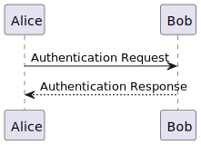

# Jupyterlab环境搭建

下面的操作假设系统中已经安装了nodejs和java，否则在搭建jupytrlab之前，先把它们的环境搭建好。

- Windows
  - [node-v16.16.0-x64.msi](https://nodejs.org/dist/v16.16.0/node-v16.16.0-x64.msi)
  - [java环境](https://www.java.com/zh-CN/download/)
- Linux
  - [node-v16.16.0-linux-x64.tar.xz](https://nodejs.org/dist/v16.16.0/node-v16.16.0-linux-x64.tar.xz)
  - `sudo apt install default-jdk`

```bash
$ wget https://github.com/plantuml/plantuml/releases/download/v1.2021.12/plantuml-1.2021.12.jar
# 在linux系统中，最好把plantuml.jar放在/usr/local/bin目录下，这样它能够被自动发现
$ ln -s plantuml-1.2021.12.jar plantuml.jar
$ conda env create --file jupyterlab.yaml
$ conda activate jupyterlab
(jupyterlab) $ pip3 install --upgrade iplantuml jupyterlab-code-formatter graphviz pydot pydotplus
(jupyterlab) $ jupyter lab build
```

## 检查jupyterlab环境

```python
import iplantuml
```

### plantuml(web版)

```python
%%plantuml -n demo_web

@startuml
Alice -> Bob: Authentication Request
Bob --> Alice: Authentication Response
@enduml
```

运行后，生成`demo_web.svg`文件


### plantuml(1.2022.6版)

```python
%%plantuml -p ./plantuml-1.2022.6.jar -n demo_1_2022_6

@startuml
Alice -> Bob: Authentication Request
Bob --> Alice: Authentication Response
@enduml
```

运行后，生成`demo_1_2022_6.svg`文件



### plantuml(1.2021.12版)

```python
%%plantuml -p ./plantuml-1.2021.12.jar -n demo_1_2021_12

@startuml
Alice -> Bob: Authentication Request
Bob --> Alice: Authentication Response
@enduml
```

运行后，生成`demo_1_2021_12.svg`文件


[plantuml release](https://github.com/plantuml/plantuml/releases)的最新版本[plantuml-1.2022.6.jar](https://github.com/plantuml/plantuml/releases/download/v1.2022.6/plantuml-1.2022.6.jar)，它与web版本生成的结果都是黑白svg文件，而老版本的[plantuml-1.2021.12.jar](https://github.com/plantuml/plantuml/releases/download/v1.2021.12/plantuml-1.2021.12.jar)显示彩色图片，所以建议采用老版本。[plantuml](https://github.com/plantuml/plantuml)的release老版本会被删除，所以将`plantuml-1.2021.12.jar`放在本地`plantuml`目录中以备不时之需。

#### png生成图片

plantuml默认方式生成svg图片格式，对于文档工作下png格式会更加的方便，在jupyterlab中输入内容：

```python
!java -jar ./plantuml-1.2022.6.jar -splash:no -tpng demo_web.uml
# !java -jar ./plantuml-1.2022.6.jar -splash:no -tpdf demo_web.uml
# !java -jar ./plantuml-1.2022.6.jar -splash:no -tlatex demo_web.uml

!java -jar ./plantuml-1.2022.6.jar -splash:no -tpng demo_1_2022_6.uml
# !java -jar ./plantuml-1.2022.6.jar -splash:no -tpdf demo_1_2022_6.uml
# !java -jar ./plantuml-1.2022.6.jar -splash:no -tlatex demo_1_2022_6.uml

!java -jar ./plantuml-1.2021.12.jar -splash:no -tpng demo_1_2021_12.uml
# !java -jar ./plantuml-1.2021.12.jar -splash:no -tpdf demo_1_2021_12.uml
# !java -jar ./plantuml-1.2021.12.jar -splash:no -tlatex demo_1_2021_12.uml
```

其中`*.uml`文件名就是在`%%plantuml`中制定的名字

plantuml的其它命令，可以参考如下：

```bash
$ java -jar ./plantuml-1.2021.12.jar -help
Usage: java -jar plantuml.jar [options] -gui
    (to execute the GUI)
    or java -jar plantuml.jar [options] [file/dir] [file/dir] [file/dir]
    (to process files or directories)

You can use the following wildcards in files/dirs:
    *    means any characters but '\'
    ?    one and only one character but '\'
    **    means any characters (used to recurse through directories)

where options include:
    -gui        To run the graphical user interface
    -tpng        To generate images using PNG format (default)
    -tsvg        To generate images using SVG format
    -teps        To generate images using EPS format
    -tpdf        To generate images using PDF format
    -tvdx        To generate images using VDX format
    -txmi        To generate XMI file for class diagram
    -tscxml        To generate SCXML file for state diagram
    -thtml        To generate HTML file for class diagram
    -ttxt        To generate images with ASCII art
    -tutxt        To generate images with ASCII art using Unicode characters
    -tlatex        To generate images using LaTeX/Tikz format
    -tlatex:nopreamble    To generate images using LaTeX/Tikz format without preamble
    -o[utput] "dir"    To generate images in the specified directory
    -DVAR1=value    To set a preprocessing variable as if '!define VAR1 value' were used
    -Sparam1=value    To set a skin parameter as if 'skinparam param1 value' were used
    -Ppragma1=value    To set pragma as if '!pragma pragma1 value' were used
    -I\path\to\file    To include file as if '!include file' were used
    -I\path\to\*.puml    To include files with pattern
    -theme xxx        To use a specific theme
    -charset xxx    To use a specific charset (default is GBK)
    -e[x]clude pattern    To exclude files that match the provided pattern
    -metadata        To retrieve PlantUML sources from PNG images
    -nometadata        To NOT export metadata in PNG/SVG generated files
    -checkmetadata        Skip PNG files that don't need to be regenerated
    -version        To display information about PlantUML and Java versions
    -v[erbose]        To have log information
    -quiet        To NOT print error message into the console
    -debugsvek        To generate intermediate svek files
    -h[elp]        To display this help message
    -testdot        To test the installation of graphviz
    -graphvizdot "exe"    To specify dot executable
    -p[ipe]        To use stdin for PlantUML source and stdout for PNG/SVG/EPS generation
    -encodesprite 4|8|16[z] "file"    To encode a sprite at gray level (z for compression) from an image
    -computeurl|-encodeurl    To compute the encoded URL of a PlantUML source file
    -decodeurl        To retrieve the PlantUML source from an encoded URL
    -syntax        To report any syntax error from standard input without generating images
    -language        To print the list of PlantUML keywords
    -checkonly        To check the syntax of files without generating images
    -failfast        To stop processing as soon as a syntax error in diagram occurs
    -failfast2        To do a first syntax check before processing files, to fail even faster
    -noerror        To skip images when error in diagrams
    -duration        To print the duration of complete diagrams processing
    -nbthread N        To use (N) threads for processing
    -nbthread auto    To use 4 threads for processing
    -timeout N        Processing timeout in (N) seconds. Defaults to 15 minutes (900 seconds).
    -author[s]        To print information about PlantUML authors
    -overwrite        To allow to overwrite read only files
    -printfonts        To print fonts available on your system
    -enablestats    To enable statistics computation
    -disablestats    To disable statistics computation (default)
    -htmlstats        To output general statistics in file plantuml-stats.html
    -xmlstats        To output general statistics in file plantuml-stats.xml
    -realtimestats    To generate statistics on the fly rather than at the end
    -loopstats        To continuously print statistics about usage
    -splash        To display a splash screen with some progress bar
    -progress        To display a textual progress bar in console
    -pipeimageindex N    To generate the Nth image with pipe option
    -stdlib        To print standard library info
    -extractstdlib    To extract PlantUML Standard Library into stdlib folder
    -filedir xxx    To behave as if the PlantUML source is in this dir (only affects '-pipe' and PicoWeb 'POST /render')
    -filename "example.puml"    To override %filename% variable
    -preproc        To output preprocessor text of diagrams
    -cypher        To cypher texts of diagrams so that you can share them
    -picoweb        To start internal HTTP Server. See https://plantuml.com/picoweb

If needed, you can setup the environment variable GRAPHVIZ_DOT.
```


## 参考

- [plantuml](https://github.com/plantuml/plantuml)
- [nodejs](https://nodejs.org/zh-cn/download/)