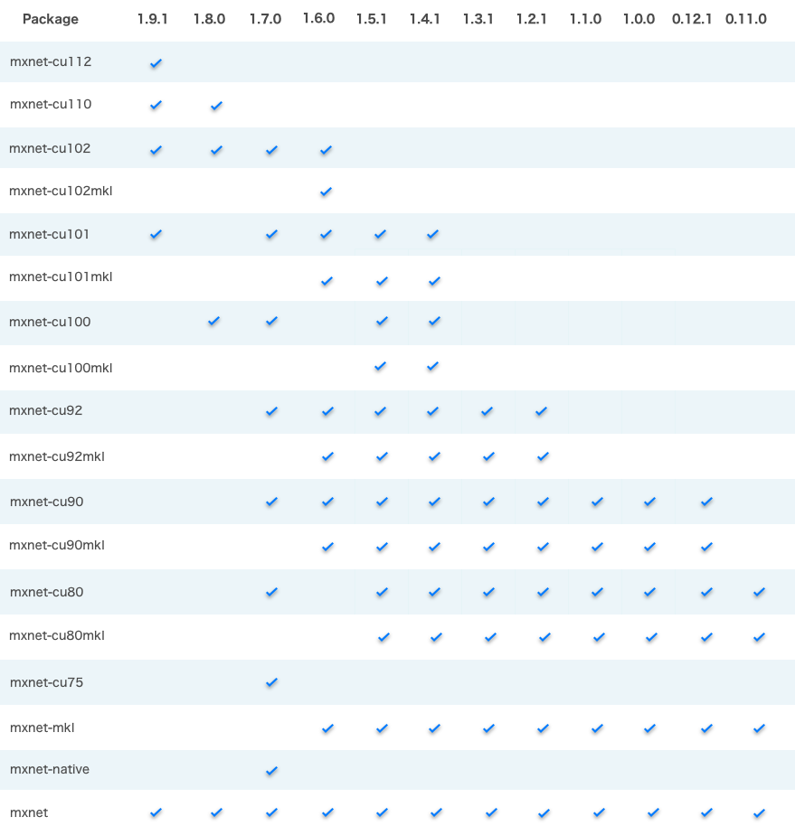

# Mxnet环境搭建



## **注意**

- mxnet-cu102mkl支持1.6.0与1.7.0，在上图中缺少了1.7.0。
- windows版本的mxnet-cu102正式版最高支持1.7.0（beta版本支持2.0.0），Linux正式版本最高支持1.9.1（beta版本支持2.0.0）。

## Ubuntu安装Mxnet

```bash
$ pip3 install --upgrade mxnet-cu102==1.9.1 -f https://dist.mxnet.io/python
```

## Windows

在Windows下安装性能更好的mkl版本，当然也可以安装`mxnet-cu102`，读着可以根据需要来安装。

```bash
$ pip3 install --upgrade mxnet-cu102mkl==1.7.0 -f https://dist.mxnet.io/python
```

## 兼容性一致性

mxnet使用较老的numpy版本，会导致当前matplotlib与pandas不兼容，可以通过如下pip方法找到一个合适的版本。对于Windows版本，兼容版本是：matplotlib-3.4.3 pandas-1.2.5。

```bash
$ pip3 install --upgrade numpy==1.16.6 pandas matplotlib
```

## 检查mxnet环境

```python
import mxnet as mx
a = mx.nd.ones((2, 3), mx.gpu())
b = a * 2 + 1
b, b.asnumpy()
```

**输出结果**

```python
(
 [[3. 3. 3.]
  [3. 3. 3.]]
 <NDArray 2x3 @gpu(0)>,
 array([[3., 3., 3.],
        [3., 3., 3.]], dtype=float32))
```

```python
mx.runtime.feature_list()
```

**输出结果**

```python
[✔ CUDA,
 ✔ CUDNN,
 ✖ NCCL,
 ✔ CUDA_RTC,
 ✖ TENSORRT,
 ✖ CPU_SSE,
 ✖ CPU_SSE2,
 ✖ CPU_SSE3,
 ✖ CPU_SSE4_1,
 ✖ CPU_SSE4_2,
 ✖ CPU_SSE4A,
 ✖ CPU_AVX,
 ✖ CPU_AVX2,
 ✔ OPENMP,
 ✖ SSE,
 ✖ F16C,
 ✖ JEMALLOC,
 ✔ BLAS_OPEN,
 ✖ BLAS_ATLAS,
 ✖ BLAS_MKL,
 ✖ BLAS_APPLE,
 ✔ LAPACK,
 ✔ MKLDNN,
 ✔ OPENCV,
 ✖ CAFFE,
 ✖ PROFILER,
 ✖ DIST_KVSTORE,
 ✖ CXX14,
 ✖ INT64_TENSOR_SIZE,
 ✔ SIGNAL_HANDLER,
 ✖ DEBUG,
 ✖ TVM_OP]
```


## 问题排查

### 问题1

```bash
FileNotFoundError: Could not find module '%CONDA_PREFIX%\lib\site-packages\mxnet\libmxnet.dll' (or one of its dependencies). Try using the full path with constructor syntax.
```

**解决方法1**： 拷贝`cudart64_102.dll`到mxnet目录下

```bash
$ cp %CONDA_PREFIX%\Library\bin\cudart64_102.dll %CONDA_PREFIX%\lib\site-packages\mxnet\
```

**解决方法2**： 增加DLL查询目录

```python
import os
os.add_dll_directory(r'{}\Library\bin'.format(os.environ['CONDA_PREFIX']))
import mxnet as mx
```

### 问题2

在Windows下，`import mxnet`后无法退出。

**解决方法**：在运行文件最后加入如下一段代码

```python
import os, signal
if os.sys.platform.startswith("win"):
    os.kill(os.getpid(), signal.SIGTERM)
```


## 参考

- [dist.mxnet.io](https://dist.mxnet.io/python)
- [Build and install Apache MXNet (incubating) from source](https://mxnet.apache.org/versions/1.9.1/get_started?platform=linux&language=python&processor=gpu&environ=pip&)
- [os.add_dll_directory](https://docs.python.org/3/library/os.html#os.add_dll_directory)
- [python module dlls](https://stackoverflow.com/questions/214852/python-module-dlls)

