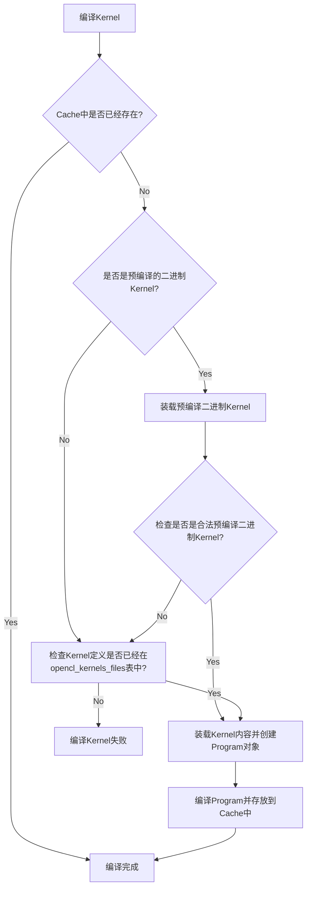

# OpenCL

## 支持的AI网络

当前OpenCL支持22个网络，如下所示：

| 模型                           | 下载地址                                                     |
| ------------------------------ | ------------------------------------------------------------ |
| MobileNetV1                    | https://paddlelite-demo.bj.bcebos.com/models/mobilenet_v1_fp32_224_fluid.tar.gz |
| MobileNetV2                    | https://paddlelite-demo.bj.bcebos.com/models/mobilenet_v2_fp32_224_fluid.tar.gz |
| MobileNetV3_large              | https://paddle-inference-dist.bj.bcebos.com/AI-Rank/mobile/MobileNetV3_large_x1_0.tar.gz |
| MobileNetV3_small              | https://paddle-inference-dist.bj.bcebos.com/AI-Rank/mobile/MobileNetV3_small_x1_0.tar.gz |
| EfficientNetB0                 | https://paddlelite-demo.bj.bcebos.com/models/EfficientNetB0.tar.gz |
| ResNet18                       | https://paddlelite-demo.bj.bcebos.com/models/resnet18_fp32_224_fluid.tar.gz |
| ResNet50                       | https://paddlelite-demo.bj.bcebos.com/models/resnet50_fp32_224_fluid.tar.gz |
| VGG16                          |                                                              |
| VGG19                          |                                                              |
| SSD-MobileNetV3-large          | https://paddle-inference-dist.bj.bcebos.com/AI-Rank/mobile/ssdlite_mobilenet_v3_large.tar.gz |
| ch_ppocr_mobile_v2.0_cls_infer | https://paddleocr.bj.bcebos.com/dygraph_v2.0/ch/ch_ppocr_mobile_v2.0_cls_infer.tar |
| ch_ppocr_mobile_v2.0_det_infer | https://paddleocr.bj.bcebos.com/PP-OCRv2/chinese/ch_PP-OCRv2_det_infer.tar |
| ch_ppocr_mobile_v2.0_rec_infer | https://paddleocr.bj.bcebos.com/PP-OCRv2/chinese/ch_PP-OCRv2_rec_infer.tar |
| DB                             |                                                              |
| inference_dnn                  |                                                              |
| Deeplabv3                      | https://paddlelite-demo.bj.bcebos.com/models/deeplab_mobilenet_fp32_fluid.tar.gz |
| UNet                           | https://paddlelite-demo.bj.bcebos.com/models/Unet.zip        |
| bisenet                        |                                                              |
| fastscnn                       |                                                              |
| bisenet_v2                     |                                                              |
| FaceBoxes                      | https://github.com/PaddlePaddle/PaddleDetection/blob/release/0.4/docs/featured_model/FACE_DETECTION.md#FaceBoxes |
| MTCNN                          | https://paddlelite-demo.bj.bcebos.com/models/mtcnn.zip       |


## 支持的AI算子

合计250个算子（包含融合算子），OpenCL支持87个。`lite/backends/opencl/cl_kernel`中定义的OpenCL Kernels文件将会被`lite/kernels/opencl`中的'buffer'或者`image`算子使用，来实现AI模型所需要的算子，如下表所示。

| 算子名                            | 是否支持OpenCL | int32 | int64 | float16 | float32 | 所属文件                                                     |
| --------------------------------- | -------------- | ----- | ----- | ------- | ------- | ------------------------------------------------------------ |
| abs                               | Y              |       |       | Y       |         | activation_image_compute.cc                                  |
| acos                              | Y              |       |       | Y       |         | trigonometric_image_compute.cc                               |
| affine_channel                    | N              |       |       |         |         |                                                              |
| affine_grid                       | N              |       |       |         |         |                                                              |
| anchor_generator                  | N              |       |       |         |         |                                                              |
| arg_max                           | Y              |       |       | Y       |         | argmax_image_compute.cc                                      |
| arg_min                           | N              |       |       |         |         |                                                              |
| argsort                           | N              |       |       |         |         |                                                              |
| asin                              | Y              |       |       | Y       |         | trigonometric_image_compute.cc                               |
| assign                            | N              |       |       |         |         |                                                              |
| assign_value                      | N              |       |       |         |         |                                                              |
| atan                              | Y              |       |       | Y       |         | trigonometric_image_compute.cc                               |
| attention_padding_mask            | N              |       |       |         |         |                                                              |
| axpy                              | N              |       |       |         |         |                                                              |
| batch_norm                        | Y              |       |       | Y       |         | batch_norm_image_compute.cc                                  |
| beam_search                       | N              |       |       |         |         |                                                              |
| beam_search_decode                | N              |       |       |         |         |                                                              |
| bilinear_interp                   | Y              |       |       | Y       |         | bilinear_interp_image_computer.cc                            |
| bilinear_interp_v2                | Y              |       |       | Y       |         | bilinear_interp_image_computer.cc                            |
| box_clip                          | N              |       |       |         |         |                                                              |
| box_coder                         | Y              |       |       | Y       |         | box_coder_image_compute.cc                                   |
| calib                             | N              |       |       |         |         |                                                              |
| calib_once                        | N              |       |       |         |         |                                                              |
| cast                              | N              |       |       |         |         |                                                              |
| clip                              | Y              |       |       | Y       |         | clip_image_compute.cc                                        |
| collect_fpn_proposals             | N              |       |       |         |         |                                                              |
| concat                            | Y              |       |       | Y       | Y       | concat_buffer_compute.cc<br />concat_image_compute.cc        |
| conditional_block                 | N              |       |       |         |         |                                                              |
| conv2d                            | Y              |       |       | Y       | Y       | conv_buffer_compute.cc<br />conv_image_compute.cc            |
| conv2d_transpose                  | Y              |       |       | Y       |         | conv_transpose_image_compute.cc                              |
| conv3d                            | N              |       |       |         |         |                                                              |
| correlation                       | N              |       |       |         |         |                                                              |
| cos                               | Y              |       |       | Y       |         | trigonometric_image_compute.cc                               |
| cos_sim                           | N              |       |       |         |         |                                                              |
| crf_decoding                      | N              |       |       |         |         |                                                              |
| crop                              | N              |       |       |         |         |                                                              |
| crop_tensor                       | N              |       |       |         |         |                                                              |
| ctc_align                         | N              |       |       |         |         |                                                              |
| cumsum                            | N              |       |       |         |         |                                                              |
| decode_bboxes                     | N              |       |       |         |         |                                                              |
| deformable_conv                   | N              |       |       |         |         |                                                              |
| density_prior_box                 | N              |       |       |         |         |                                                              |
| depthwise_conv2d                  | Y              |       |       | Y       | Y       | conv_image_compute.cc<br />depthwise_conv2d_buffer_compute.cc |
| depthwise_conv2d_transpose        | Y              |       |       | Y       |         | conv_transpose_image_compute.cc                              |
| dequantize_linear                 | N              |       |       |         |         |                                                              |
| distribute_fpn_proposals          | N              |       |       |         |         |                                                              |
| dropout                           | Y              |       |       | Y       |         | dropout_image_compute.cc                                     |
| elementwise_add                   | Y              |       |       | Y       | Y       | elementwise_add_buffer_compute.cc<br />elementwise_image_compute.cc |
| elementwise_div                   | Y              |       |       | Y       |         | elementwise_image_compute.cc                                 |
| elementwise_floordiv              | Y              |       |       | Y       |         | elementwise_image_compute.cc                                 |
| elementwise_max                   | Y              |       |       | Y       |         | elementwise_image_compute.cc                                 |
| elementwise_min                   | Y              |       |       | Y       |         | elementwise_image_compute.cc                                 |
| elementwise_mod                   | Y              |       |       | Y       |         | elementwise_image_compute.cc                                 |
| elementwise_mul                   | Y              |       |       | Y       |         | elementwise_image_compute.cc                                 |
| elementwise_pow                   | Y              |       |       | Y       |         | elementwise_image_compute.cc                                 |
| elementwise_sub                   | Y              |       |       | Y       |         | elementwise_image_compute.cc                                 |
| elu                               | N              |       |       |         |         |                                                              |
| equal                             | N              |       |       |         |         |                                                              |
| erf                               | N              |       |       |         |         |                                                              |
| exp                               | Y              |       |       | Y       |         | activation_image_compute.cc                                  |
| expand                            | Y              |       |       | Y       |         | expand_image_compute.cc                                      |
| expand_as                         | N              |       |       |         |         |                                                              |
| expand_v2                         | N              |       |       |         |         |                                                              |
| fc                                | Y              |       |       | Y       | Y       | fc_buffer_compute.cc<br />fc_image_compute.cc                |
| feed                              | N              |       |       |         |         |                                                              |
| fetch                             | N              |       |       |         |         |                                                              |
| fill_any_like                     | N              |       |       |         |         |                                                              |
| fill_constant                     | N              |       |       |         |         |                                                              |
| fill_constant_batch_size_like     | N              |       |       |         |         |                                                              |
| fill_zeros_like                   | N              |       |       |         |         |                                                              |
| flatten                           | Y              |       |       | Y       |         | reshape_image_compute.cc                                     |
| flatten2                          | Y              |       |       | Y       |         | reshape_image_compute.cc                                     |
| flatten_contiguous_range          | N              |       |       |         |         |                                                              |
| flip                              | N              |       |       |         |         |                                                              |
| floor                             | N              |       |       |         |         |                                                              |
| fusion_elementwise_add_activation | Y              |       |       | Y       | Y       | elementwise_image_compute.cc<br />fusion_elementwise_add_activation_buffer_compute.cc |
| fusion_elementwise_div_activation | Y              |       |       | Y       |         | elementwise_image_compute.cc                                 |
| fusion_elementwise_max_activation | N              |       |       |         |         |                                                              |
| fusion_elementwise_min_activation | N              |       |       |         |         |                                                              |
| fusion_elementwise_mul_activation | Y              |       |       | Y       |         | elementwise_image_compute.cc                                 |
| fusion_elementwise_pow_activation | N              |       |       |         |         |                                                              |
| fusion_elementwise_sub_activation | Y              |       |       | Y       |         | elementwise_image_compute.cc<br />fusion_elementwise_sub_activation_image_compute.cc |
| gather                            | Y              |       |       | Y       |         | gather_image_compute.cpp                                     |
| gather_nd                         | N              |       |       |         |         |                                                              |
| gather_tree                       | N              |       |       |         |         |                                                              |
| gaussian_random                   | N              |       |       |         |         |                                                              |
| gelu                              | Y              |       |       | Y       |         | activation_image_compute.cc                                  |
| generate_proposals                | N              |       |       |         |         |                                                              |
| generate_proposals_v2             | N              |       |       |         |         |                                                              |
| greater_equal                     | N              |       |       |         |         |                                                              |
| greater_than                      | Y              |       |       | Y       |         | greater_than_image_compute.cc                                |
| grid_sampler                      | Y              |       |       | Y       |         | grid_sampler_image_compute.cc                                |
| group_norm                        | N              |       |       |         |         |                                                              |
| gru                               | N              |       |       |         |         |                                                              |
| gru_unit                          | N              |       |       |         |         |                                                              |
| hard_sigmoid                      | Y              |       |       | Y       |         | activation_image_compute.cc                                  |
| hard_swish                        | Y              |       |       | Y       |         | activation_image_compute.cc                                  |
| im2sequence                       | N              |       |       |         |         |                                                              |
| increment                         | N              |       |       |         |         |                                                              |
| index_select                      | N              |       |       |         |         |                                                              |
| instance_norm                     | Y              |       |       | Y       |         | instance_norm_image_compute.cc                               |
| inverse                           | N              |       |       |         |         |                                                              |
| io_copy                           | Y              | Y     | Y     | Y       | Y       | io_copy_buffer_compute.cc，支持所有数据类型                  |
| io_copy_once                      | Y              | Y     | Y     | Y       | Y       | io_copy_buffer_compute.cc，支持所有数据类型                  |
| is_empty                          | N              |       |       |         |         |                                                              |
| layer_norm                        | Y              |       |       | Y       |         | layer_norm_image_compute.cc                                  |
| layout                            | Y              | Y     | Y     | Y       | Y       | layout_image_compute.cc，支持所有数据类型                    |
| layout_once                       | Y              | Y     | Y     | Y       | Y       | layout_image_compute.cc，支持所有数据类型                    |
| leaky_relu                        | Y              |       |       | Y       |         | activation_image_compute.cc                                  |
| less_equal                        | N              |       |       |         |         |                                                              |
| less_than                         | N              |       |       |         |         |                                                              |
| linspace                          | N              |       |       |         |         |                                                              |
| lod_array_length                  | N              |       |       |         |         |                                                              |
| lod_reset                         | N              |       |       |         |         |                                                              |
| log                               | Y              |       |       | Y       |         | activation_image_compute.cc                                  |
| log_softmax                       | N              |       |       |         |         |                                                              |
| logical_and                       | N              |       |       |         |         |                                                              |
| logical_not                       | N              |       |       |         |         |                                                              |
| logical_or                        | N              |       |       |         |         |                                                              |
| logical_xor                       | N              |       |       |         |         |                                                              |
| lookup_table                      | N              |       |       |         |         |                                                              |
| lookup_table_dequant              | N              |       |       |         |         |                                                              |
| lookup_table_v2                   | N              |       |       |         |         |                                                              |
| lrn                               | Y              |       |       | Y       |         | lrn_image_compute.cc                                         |
| lstm                              | N              |       |       |         |         |                                                              |
| match_matrix_tensor               | N              |       |       |         |         |                                                              |
| matmul                            | Y              |       |       | Y       | Y       | matmul_buffer_compute.cc<br />matmul_image_compute.cc<br />mul_buffer_compute.cc（定义为mul算子，与matmul功能一致，建议忽略此算子） |
| matmul_v2                         | Y              |       |       | Y       | Y       | matmul_buffer_compute.cc<br />matmul_image_compute.cc        |
| matrix_nms                        | N              |       |       |         |         |                                                              |
| max_pool2d_with_index             | N              |       |       |         |         |                                                              |
| mean                              | N              |       |       |         |         |                                                              |
| merge_lod_tensor                  | N              |       |       |         |         |                                                              |
| meshgrid                          | N              |       |       |         |         |                                                              |
| mish                              | N              |       |       |         |         |                                                              |
| mul                               | N              |       |       |         |         |                                                              |
| multiclass_nms                    | N              |       |       |         |         |                                                              |
| multiclass_nms2                   | N              |       |       |         |         |                                                              |
| multiclass_nms3                   | N              |       |       |         |         |                                                              |
| nearest_interp                    | Y              |       |       | Y       |         | nearest_interp_image_compute.cc                              |
| nearest_interp_v2                 | Y              |       |       | Y       |         | nearest_interp_image_compute.cc                              |
| negative                          | N              |       |       |         |         |                                                              |
| norm                              | N              |       |       |         |         |                                                              |
| not_equal                         | N              |       |       |         |         |                                                              |
| one_hot                           | N              |       |       |         |         |                                                              |
| one_hot_v2                        | N              |       |       |         |         |                                                              |
| p_norm                            | N              |       |       |         |         |                                                              |
| pad2d                             | Y              |       |       | Y       |         | pad2d_image_compute.cc                                       |
| pad3d                             | N              |       |       |         |         |                                                              |
| pixel_shuffle                     | Y              |       |       | Y       |         | pixel_shuffle_image_compute.cc                               |
| polygon_box_transform             | N              |       |       |         |         |                                                              |
| pool2d                            | Y              |       |       | Y       | Y       | pool_buffer_compute.cc<br />pool_image_compute.cc            |
| pow                               | N              |       |       |         |         |                                                              |
| prelu                             | Y              |       |       | Y       |         | activation_image_compute.cc                                  |
| print                             | N              |       |       |         |         |                                                              |
| prior_box                         | N              |       |       |         |         |                                                              |
| quantize_linear                   | N              |       |       |         |         |                                                              |
| range                             | N              |       |       |         |         |                                                              |
| read_from_array                   | N              |       |       |         |         |                                                              |
| reciprocal                        | N              |       |       |         |         |                                                              |
| reduce_all                        | N              |       |       |         |         |                                                              |
| reduce_any                        | N              |       |       |         |         |                                                              |
| reduce_max                        | Y              |       |       | Y       |         | max_image_compute.cc                                         |
| reduce_mean                       | Y              |       |       | Y       |         | reduce_mean_image_compute.cc                                 |
| reduce_min                        | N              |       |       |         |         |                                                              |
| reduce_prod                       | N              |       |       |         |         |                                                              |
| reduce_sum                        | N              |       |       |         |         |                                                              |
| relu                              | Y              |       |       | Y       | Y       | activation_buffer_compute.cc<br />activation_image_compute.cc |
| relu6                             | Y              |       |       | Y       |         | activation_image_compute.cc                                  |
| relu_clipped                      | N              |       |       |         |         |                                                              |
| reshape                           | Y              |       |       | Y       |         | reshape_image_compute.cc                                     |
| reshape2                          | Y              |       |       | Y       |         | reshape_image_compute.cc                                     |
| retinanet_detection_output        | N              |       |       |         |         |                                                              |
| reverse                           | N              |       |       |         |         |                                                              |
| rnn                               | N              |       |       |         |         |                                                              |
| roi_align                         | N              |       |       |         |         |                                                              |
| roi_perspective_transform         | N              |       |       |         |         |                                                              |
| rsqrt                             | Y              |       |       | Y       |         | activation_image_compute.cc                                  |
| sampling_id                       | N              |       |       |         |         |                                                              |
| scale                             | Y              |       |       | Y       |         | scale_image_compute.cc                                       |
| scatter                           | N              |       |       |         |         |                                                              |
| scatter_nd_add                    | N              |       |       |         |         |                                                              |
| search_aligned_mat_mul            | N              |       |       |         |         |                                                              |
| search_attention_padding_mask     | N              |       |       |         |         |                                                              |
| search_fc                         | N              |       |       |         |         |                                                              |
| search_grnn                       | N              |       |       |         |         |                                                              |
| search_group_padding              | N              |       |       |         |         |                                                              |
| search_seq_arithmetic             | N              |       |       |         |         |                                                              |
| search_seq_depadding              | N              |       |       |         |         |                                                              |
| search_seq_fc                     | N              |       |       |         |         |                                                              |
| search_seq_softmax                | N              |       |       |         |         |                                                              |
| select_input                      | N              |       |       |         |         |                                                              |
| sequence_arithmetic               | N              |       |       |         |         |                                                              |
| sequence_concat                   | N              |       |       |         |         |                                                              |
| sequence_conv                     | N              |       |       |         |         |                                                              |
| sequence_expand                   | N              |       |       |         |         |                                                              |
| sequence_expand_as                | N              |       |       |         |         |                                                              |
| sequence_mask                     | N              |       |       |         |         |                                                              |
| sequence_pad                      | N              |       |       |         |         |                                                              |
| sequence_pool                     | N              |       |       |         |         |                                                              |
| sequence_reshape                  | N              |       |       |         |         |                                                              |
| sequence_reverse                  | N              |       |       |         |         |                                                              |
| sequence_softmax                  | N              |       |       |         |         |                                                              |
| sequence_topk_avg_pooling         | N              |       |       |         |         |                                                              |
| sequence_unpad                    | N              |       |       |         |         |                                                              |
| shape                             | Y              | Y     | Y     | Y       | Y       | shape_buffer_compute.cc，支持所有数据类型                    |
| shuffle_channel                   | Y              |       |       | Y       |         | shuffle_channel_image_compute.cc                             |
| sigmoid                           | Y              |       |       | Y       | Y       | activation_buffer_compute.cc<br />activation_image_compute.cc |
| sign                              | N              |       |       |         |         |                                                              |
| sin                               | Y              |       |       | Y       |         | trigonometric_image_compute.cc                               |
| slice                             | Y              | Y     | Y     | Y       | Y       | slice_buffer_compute.cc<br />slice_image_compute.cc          |
| softmax                           | Y              |       |       | Y       |         | softmax_image_compute.cc                                     |
| softplus                          | N              |       |       |         |         |                                                              |
| softsign                          | N              |       |       |         |         |                                                              |
| sparse_conv2d                     | N              |       |       |         |         |                                                              |
| split                             | Y              |       |       | Y       |         | split_image_compute.cc                                       |
| split_lod_tensor                  | N              |       |       |         |         |                                                              |
| sqrt                              | Y              |       |       | Y       |         | activation_image_compute.cc                                  |
| square                            | Y              |       |       | Y       |         | activation_image_compute.cc                                  |
| squeeze                           | Y              | Y     | Y     | Y       | Y       | squeeze_unsqueeze_buffer_computer.cc，支持所有数据类型       |
| squeeze2                          | Y              | Y     | Y     | Y       | Y       | squeeze_unsqueeze_buffer_computer.cc，支持所有数据类型       |
| stack                             | N              |       |       |         |         |                                                              |
| strided_slice                     | N              |       |       |         |         |                                                              |
| subgraph                          | N              |       |       |         |         |                                                              |
| sum                               | N              |       |       |         |         |                                                              |
| swish                             | Y              |       |       | Y       |         | activation_image_compute.cc                                  |
| sync_batch_norm                   | Y              |       |       | Y       |         | batch_norm_image_compute.cc                                  |
| tan                               | Y              |       |       | Y       |         | trigonometric_image_compute.cc                               |
| tanh                              | Y              |       |       | Y       |         | activation_image_compute.cc                                  |
| tensor_array_to_tensor            | N              |       |       |         |         |                                                              |
| thresholded_relu                  | N              |       |       |         |         |                                                              |
| tile                              | N              |       |       |         |         |                                                              |
| top_k                             | N              |       |       |         |         |                                                              |
| top_k_v2                          | N              |       |       |         |         |                                                              |
| transpose                         | Y              |       |       | Y       |         | transpose_image_compute.cc                                   |
| transpose2                        | Y              |       |       | Y       |         | transpose_image_compute.cc                                   |
| tril_triu                         | N              |       |       |         |         |                                                              |
| unbind                            | N              |       |       |         |         |                                                              |
| unfold                            | N              |       |       |         |         |                                                              |
| uniform_random                    | N              |       |       |         |         |                                                              |
| unique_with_counts                | N              |       |       |         |         |                                                              |
| unsqueeze                         | Y              | Y     | Y     | Y       | Y       | squeeze_unsqueeze_buffer_computer.cc，支持所有数据类型       |
| unsqueeze2                        | Y              | Y     | Y     | Y       | Y       | squeeze_unsqueeze_buffer_computer.cc，支持所有数据类型       |
| unstack                           | N              |       |       |         |         |                                                              |
| var_conv_2d                       | N              |       |       |         |         |                                                              |
| where                             | N              |       |       |         |         |                                                              |
| where_index                       | N              |       |       |         |         |                                                              |
| while                             | N              |       |       |         |         |                                                              |
| write_back                        | N              |       |       |         |         |                                                              |
| write_to_array                    | N              |       |       |         |         |                                                              |
| yolo_box                          | Y              | Y     | Y     | Y       | Y       | yolo_box_buffer_compute.cc，支持所有数据类型                 |
| max                               | Y              |       |       | Y       |         | max_image_compute.cc                                         |

**source**: `lite/kernels/opencl`

**注意**

- `max`与`mul`算在在官方的文档中未说明支持，但是在实现的C/C++文件中我们发现了它的相关实现，所以在使用的时候需要做相关的验证工作，确认它的正确运行。
- 从kernel的使用情况来看，`mul`与`matmul`使用相同的`buffer/mat_mul_kernel.cl`，所以它们试做相同算子，并且在使用的时候使用`matmul`而非`mul`


## OpenCL Kernel组织结构

### 目录结构

`cl_common.h`是一个公用的头文件，每个`*.cl`文件中都会有`#include <cl_common.h>`

- buffer：包含**12**个Kernels

- image：包含**58**个Kernels

  合计**70**个Kernels

```bash
Paddle-Lite\lite\backends\opencl\cl_kernel
|   cl_common.h
|
+---buffer
|       concat_kernel.cl
|       depthwise_conv2d_kernel.cl
|       elementwise_add_kernel.cl
|       fc_kernel.cl
|       im2col_kernel.cl
|       mat_mul_kernel.cl
|       pool_kernel.cl
|       relu_kernel.cl
|       sigmoid_kernel.cl
|       slice_kernel.cl
|       transpose_kernel.cl
|       yolo_box_kernel.cl
|
\---image
        activation_kernel.cl
        argmax_kernel.cl
        batch_norm_kernel.cl
        bilinear_interp_kernel.cl
        box_coder_kernel.cl
        channel_add_kernel.cl
        clip_kernel.cl
        concat_default_kernel.cl
        concat_kernel.cl
        conv2d_1x1_default_kernel.cl
        conv2d_1x1_default_mali_kernel.cl
        conv2d_1x1_opt_kernel.cl
        conv2d_3x3_default_kernel.cl
        conv2d_3x3_kernel.cl
        conv2d_5x5_kernel.cl
        conv2d_5x5_opt_kernel.cl
        conv2d_7x7_kernel.cl
        conv2d_7x7_opt_kernel.cl
        conv2d_common_kernel.cl
        conv2d_transpose_kernel.cl
        conv2d_winograd_3x3s1_kernel.cl
        depthwise_conv2d_basic_kernel.cl
        depthwise_conv2d_kernel.cl
        depthwise_conv2d_transpose_kernel.cl
        dropout_kernel.cl
        elementwise_add_kernel.cl
        elementwise_broadcast_kernel.cl
        elementwise_kernel.cl
        elementwise_mul_kernel.cl
        elementwise_sub_kernel.cl
        expand_kernel.cl
        fc_kernel.cl
        gather_kernel.cl
        greater_than_kernel.cl
        grid_sampler_kernel.cl
        instance_norm_kernel.cl
        layer_norm_kernel.cl
        layout_kernel.cl
        lrn_kernel.cl
        matmul_kernel.cl
        matmul_opt_kernel.cl
        matmul_unpersistable_y_kernel.cl
        matmul_xtranspose_kernel.cl
        max_kernel.cl
        nearest_interp_kernel.cl
        pad2d_kernel.cl
        pixel_shuffle_kernel.cl
        pool_deprecated_kernel.cl
        pool_kernel.cl
        reduce_kernel.cl
        reshape_kernel.cl
        scale_kernel.cl
        shuffle_channel_kernel.cl
        slice_kernel.cl
        softmax_kernel.cl
        split_kernel.cl
        transpose_kernel.cl
        trigonometric_kernel.cl
```

### opencl_kernels_files查询表

在编译Paddle-Lite时，Paddle-Lite会通过`lite/tools/cmake_tools/gen_opencl_code.py`工具将上述所有支持的Kernels文件制作成一张`opencl_kernels_files`查询表，将它存在在`lite/backends/opencl/opencl_kernels_source.cc`文件中，一般的命令行如下所示：

```bash
$ python3 lite/tools/cmake_tools/gen_opencl_code.py lite/backends/opencl/cl_kernel lite/backends/opencl/opencl_kernels_source.cc
```

`opencl_kernels_source.cc`中的`opencl_kernels_files`定义样式如下:

```c++
extern const std::map<std::string, std::vector<unsigned char>> opencl_kernels_files = {
    {"buffer/concat_kernel.cl", {0x23, 0x70, 0x72, 0x61, ...},
    {"buffer/depthwise_conv2d_kernel.cl", {0x23, 0x70, 0x72,...},
    ...
    {"image/matmul_kernel.cl", {0x23, 0x70, 0x72, 0x61, ...},
    ...
}
```

在`CLRuntime::CreateProgramFromSource(..., file_name, ...)`运行的时候会根据文件名，比如说`file_name="image/argmax_kernel.cl"`从`opencl_kernels_files`中获取它的kernel内容来创建`cl::Program`对象，详情可以参见：`lite/backends/opencl/cl_runtime.cc`第332行`CLRuntime::CreateProgramFromSource()`。

### OpenCL Kernel编译

在编译OpenCL的Kernel时候，为提高性能，会依次使用Cache，预编译二进制Kernel和源代码Kernel进行编译，算法如下图1所示。



​                                              图1 编译OpenCL Kernel算法

**注意**

- 预编译二进制Kernel文件中包含的是Kernel汇编指令，而源代码中包含的是C/C++源代码，所以预编译二进制Kernel的编译效率会搞很多，类似如下代码

  ```ASM
          // .globl       softmax_width
  .global .samplerref SAMPLER = { addr_mode_0 = clamp_to_border, addr_mode_1 = clamp_to_border, addr_mode_2 = clamp_to_border, filter
  _mode = nearest, force_unnormalized_coords = 1 };
  // softmax_1x1$tmp has been demoted
  
  .entry softmax_width(
          .param .texref softmax_width_param_0,
          .param .surfref softmax_width_param_1,
          .param .u32 softmax_width_param_2,
          .param .u32 softmax_width_param_3,
          .param .u32 softmax_width_param_4,
          .param .u32 softmax_width_param_5
  )
  {
          .reg .pred      %p<57>;
          .reg .f32       %f<617>;
          .reg .b32       %r<160>;
          .reg .b64       %rd<4>;
  
  
          ld.param.u32    %r42, [softmax_width_param_2];
          ld.param.u32    %r43, [softmax_width_param_3];
          ld.param.u32    %r44, [softmax_width_param_4];
          ld.param.u32    %r41, [softmax_width_param_5];
          mov.b32 %r45, %envreg3;
          mov.u32         %r46, %ctaid.x;
          mov.u32         %r47, %ntid.x;
          mad.lo.s32      %r1, %r46, %r47, %r45;
  ```

- 预编译二进制Kernel文件可以通过`CLRuntime::SetBinaryPathName(const std::string& path, const std::string& name)`来设置，在推断C/C++程序中，可以通过上层接口函数`MobileConfig::set_opencl_binary_path_name(const std::string &path, const std::string &name)`或者`CxxConfig::set_opencl_binary_path_name(const std::string &path, const std::string &name)`来进行配置。

- 预编译二进制Kernel文件需要校验`sn_key`，默认值为`lite_opencl_precompiled_binary_identifier`，对应的`value`中依次存放

  1. **aarch_info**

  2. **lite_version**

  3. **build_options**

  4. **platform_info**

  5. **device_version**

  6. **driver_version**

  7. **string("place_holder")**

  具体实现详见`CLRuntime::GetSN(const std::string options)`（第485行），这个实现的定义实现中有很奇怪的代码，如下所示

  ```c++
    const std::string aarch =
  #if defined(__aarch64__)
        "android_armv8";
  #else
        "android_armv7";
  #endif
  #if defined(_WIN64)
    "win64";
  #elif defined(_WIN32)
    "win32";
  #endif
  ```

  在非Windows平台，arch要么是android_armv8，那么是android_armv7，这个应该没什么问题，但是在Windows平台，它在后面会多出一个win64或者win32，代码能过？

  在使用GetSN的时候（第251行），如下

  ```
  ...
        } else if (host::memcmp(((sn_iter->second)[0]).data(),
                                GetSN(precision_option).data(),
                                GetSN(precision_option).length())) {
          std::string sn_str(reinterpret_cast<char*>((sn_iter->second)[0].data()),
                             (sn_iter->second)[0].size());
          LOG(INFO) << "\nSN required: " << GetSN(precision_option)
                    << "\tsize: " << GetSN(precision_option).length()
                    << "\nSN in bin file: " << sn_str
                    << "\tsize: " << ((sn_iter->second)[0]).size();
          LOG(WARNING) << "The precompiled OpenCL binary[" << bin_file
                       << "] is invalid!";
  ...
  ```

  `GetSN(precision_option)`的N次调用的意义就是为了让代码写起来简单一些？可能编译器足够强大，这种代码能够被很好的优化吧？

- 装载一次二进制Kernel文件后，逻辑上网络所需要的Kernels都已经编译Ready并存放在Cache中了，那么对于使用它们性能将会有很大的提高。从这个角度看，可以把网络需要的Kernels在运行之前先制作好一份二进制Kernel文件，然后运行前加载一次即可，它是一个手工活，需要工具配合。如果我们查看Paddle-Lite源代码的话，我们会发现

  - 在`CLRuntime::SaveProgram()`（cl_runtime.cc第364行）能够保存运行过的Kernels

  - 在`RuntimeProgram::~RuntimeProgram()`（program.h第218行）能够保存CLRuntime的两个重要数据

    ```c++
        // save program kernel cache & tuned params
        CLRuntime::Global()->SaveProgram();
        CLRuntime::Global()->SaveTuned();
    ```

  - `light_api.h`（第141行）定义了`std::unique_ptr<RuntimeProgram> program_`，所以只要使用`MobileConfig`创建`LightPredictor`，运行一下网络后正常退出即可。**切记**：`MobileConfig::set_opencl_binary_path_name(const std::string& path, const std::string& name)`必须被设置，否则无保存路径！为了方便起见，我使用python代码来完成上面的任务，如下：

    ```python
    from paddlelite import lite
    
    config = lite.MobileConfig()
    config.set_model_from_file("mobilenet_v1_opencl.nb")
    config.set_opencl_binary_path_name("./opencl_kernel", "kernel_binary")
    predictor = lite.create_paddle_predictor(config)
    
    import numpy as np
    from PIL import Image
    
    img = (
        (
            np.asarray(Image.open("cat.jpg").crop((200, 0, 1400, 1200)).resize((224, 224)))
            / 255.0
        )
        .astype(np.float32)
        .transpose((2, 0, 1))[np.newaxis, ...]
    )
    
    input_tensor = predictor.get_input(0)
    input_tensor.from_numpy(img)
    predictor.run()
    out = predictor.get_output(0).numpy()
    
    with open("synset.txt", "r", encoding="utf-8") as f:
        labels = np.array([line.strip() for line in f if line.strip()])
    
    from scipy.special import softmax
    
    out = softmax(out, axis=-1)
    o_index = out.argsort(axis=-1)[..., -5:][..., ::-1]
    print(o_index.ravel(), out[..., o_index].ravel(), labels[o_index].ravel())
    ```

    `opencl_kernel`目录中存放二进制kernel文件`kernel_binary`，运行完成后

    ```bash
    $ cd opencl_kernel
    $ ls -l
    -rw-r--r-- 1 292288 kernel_binary
    ```

    如果查看`kernel_binary`的头部，那么在Windows下就会看见不正确的`android_armv7`信息出现

    ```bash
    $ cat kernel_binary | head -2
    ╝□□╝  H□╚□@╚□□h□ □□□}□╝□□□╝4)lite_opencl_precompiled_binary_identifier□□□╝kandroid_armv7; a404b451c; Precision: FP
    32; NVIDIA CUDA, FULL_PROFILE; OpenCL 1.2 CUDA; 457.09; place_holder□□□╝peimage/softmax_kernel.cl -cl-fast-relaxed-math -cl-mad-
    enable -DCL_DTYPE_float -DCL_DTYPE_FLOAT_FORCE z□□╝>|//
    // Generated by NVIDIA NVVM Compiler
    ```
  
  - 检查`lite/api/cxx_api.h`，发现`std::shared_ptr<RuntimeProgram> program_`也是`Predictor`的成员变量，所以采用`CxxConfig::set_opencl_binary_path_name(const std::string& path, const std::string& name)`也能够保存二进制Kernel文件。


## OpenCL算子开发

OpenCL的算子必须继承`paddle::lite::KernelLite`类，它的定义详见：`lite/core/kernel.h`头文件，在[KernelLite类关系图](https://github.com/SNSerHello/MyNotes/tree/main/paddlelite)中也对它进行了详细的说明。运行一个算子，它至少会运行三个步骤

1. PrepareForRun()，仅仅在第一次中运行
2. ReInitWhenNeeded()
3. Run()

在OpenCL算子实现中，PrepareForRun()与Run()是必须被实现的（Relu算子是最常见的OpenCL算子之一，我们用它来做一个例子说明，如下所示）

**PrepareForRun()**一般用于增加Kernel文件进行编译，它的优化策略可以参考**OpenCL Kernel编译**部分。

```c++
  void PrepareForRun() override {
    auto& context = ctx_->As<OpenCLContext>();
    context.cl_context()->AddKernel(kernel_func_name_,
                                    "buffer/relu_kernel.cl",
                                    build_options_,
                                    time_stamp_);
  }
```

**source**: `lite/kernels/opencl/activation_buffer_compute.cc`

**Run()**一般用于OpenCL算子的计算过程，请**注意**： 因为`paddle::lite::KernelBase`中使用`event_`来做Profile，所以`EnqueueNDRangeKernel`中也使用它。

```c++
  void Run() override {
    auto& param = *param_.get_mutable<param_t>();
    const auto& x_dims = param.X->dims();
    size_t count = x_dims.production();

    auto& context = ctx_->As<OpenCLContext>();
    CHECK(context.cl_context() != nullptr);
    auto* x_buf = param.X->data<float, cl::Buffer>();
    auto* out_buf = param.Out->mutable_data<float, cl::Buffer>(TARGET(kOpenCL));
    STL::stringstream kernel_key;
    kernel_key << kernel_func_name_ << build_options_ << time_stamp_;
    auto kernel = context.cl_context()->GetKernel(kernel_key.str());
    VLOG(4) << TargetToStr(param.X->target());
    VLOG(4) << TargetToStr(param.Out->target());

    int arg_idx = 0;
    cl_int status = kernel.setArg(arg_idx, *x_buf);
    CL_CHECK_FATAL(status);
    status = kernel.setArg(++arg_idx, (const int)count);
    CL_CHECK_FATAL(status);
    status = kernel.setArg(++arg_idx, *out_buf);
    CL_CHECK_FATAL(status);

    auto global_work_size = cl::NDRange{count};

    status = EnqueueNDRangeKernel(context,
                                  kernel,
                                  cl::NullRange,
                                  global_work_size,
                                  cl::NullRange,
                                  nullptr,
                                  event_);
    CL_CHECK_FATAL(status);
  }
```

**source**: `lite/kernels/opencl/activation_buffer_compute.cc`

在`paddle::lite::KernelBase`中，profile部分的实现如下所示。

```c++
  virtual void SetProfileRuntimeKernelInfo(
      paddle::lite::profile::OpCharacter* ch) {
    ch->kernel_func_name = std::string("NotImpl");
#ifdef LITE_WITH_OPENCL
    ch->cl_event = event_;
#endif
  }
```

**source**: `lite/core/kernel.h`

这种实现的主要问题是子类无法重复利用父类的成果，比如说我们希望在子类中的使用方式

```c++
  virtual void SetProfileRuntimeKernelInfo(
      paddle::lite::profile::OpCharacter* ch) {
      KernelBase::SetProfileRuntimeKernelInfo(ch);
      do_somethings_only_for_sub_classes(); // 如果子类没有特别需求，那么SetProfileRuntimeKernelInfo就不要在子类中进行覆盖(override)了
  }
```

因为`paddle::lite::KernelBase`中的奇葩写法，导致了在每个OpenCL算子的实现的时候，都需要重新一遍，一旦父类发生变化，可能就直接影响所有的子类，现在的实现例子如下

- `ReluCompute`类中的写法

  ```c++
  #ifdef LITE_WITH_PROFILE
    void SetProfileRuntimeKernelInfo(paddle::lite::profile::OpCharacter* ch) {
      ch->kernel_func_name = kernel_func_name_;
      ch->cl_event =
          event_;  // `event_` defined in `kernel.h`, valid after kernel::Run
    }
  #endif
  ```

  **source**: `lite/kernels/opencl/activation_buffer_compute.cc`

- `SigmoidCompute`类中的写法

  ```c++
  #ifdef LITE_WITH_PROFILE
    void SetProfileRuntimeKernelInfo(paddle::lite::profile::OpCharacter* ch) {
      ch->kernel_func_name = kernel_func_name_;
      ch->cl_event =
          event_;  // `event_` defined in `kernel.h`, valid after kernel::Run
    }
  #endif
  ```

  **source**: `lite/kernels/opencl/activation_buffer_compute.cc`

- `ArgmaxComputeImage2D`类中的写法

  ```c++
  #ifdef LITE_WITH_PROFILE
    void SetProfileRuntimeKernelInfo(paddle::lite::profile::OpCharacter* ch) {
      ch->kernel_func_name = kernel_func_name_;
      ch->global_work_size = ch->NDRangeToStr(gws_);
      ch->cl_event =
          event_;  // `event_` defined in `kernel.h`, valid after kernel::Run
    }
  #endif
  ```

  **source**: `lite/kernels/opencl/argmax_image_compute.cc`

在正常情况下，`ReluCompute`和`SigmoidCompute`是无需覆盖`SetProfileRuntimeKernelInfo(...)`，ArgmaxComputeImage2D中只要解决`global_work_size`部分即可，那样的话，代码会看起来很舒服，不是吗？


## OpenCL算子注册

Paddle-Lite的OpenCL算子都是`KernelLite`的子类，在实现`PrepareForRun()`与`Run()`等相关方法后，算子类需要通过`REGISTER_LITE_KERNEL`进行注册。

```c++
#define REGISTER_LITE_KERNEL(                                                 \
    op_type__, target__, precision__, layout__, KernelClass, alias__)         \
  static paddle::lite::KernelRegistrar                                        \
      op_type__##target__##precision__##layout__##alias__##_kernel_registry(  \
          #op_type__,                                                         \
          TARGET(target__),                                                   \
          PRECISION(precision__),                                             \
          DATALAYOUT(layout__),                                               \
          []() {                                                              \
            std::unique_ptr<KernelClass> x(new KernelClass);                  \
            x->set_op_type(#op_type__);                                       \
            x->set_alias(#alias__);                                           \
            return x;                                                         \
          });                                                                 \
  int touch_##op_type__##target__##precision__##layout__##alias__() {         \
    op_type__##target__##precision__##layout__##alias__##_kernel_registry     \
        .touch();                                                             \
    OpKernelInfoCollector::Global().AddKernel2path(                           \
        #op_type__ "," #target__ "," #precision__ "," #layout__ "," #alias__, \
        __FILE__);                                                            \
    return 0;                                                                 \
  }                                                                           \
  ParamTypeRegistry(                                                          \
      op_type__, target__, precision__, layout__, KernelClass, alias__)
```

它的注册比较简单，分成三个部分：

- 定义一个静态`paddle::lite::KernelRegistrar`变量，名字由它的target, precision等一堆属性来组成，避免重命名。算子类实例产生方法，通过`KernelFactory::RegisterCreator(...)`注册到`op_registry_`数据结构中，即如下代码块

  ```c++
            []() {                                                              \
              std::unique_ptr<KernelClass> x(new KernelClass);                  \
              x->set_op_type(#op_type__);                                       \
              x->set_alias(#alias__);                                           \
              return x;                                                         \
            }
  ```

  在`KernelFactory::Create(...)`中会被真正实例化成一个operator

- 定义一个touch函数，它的函数名由op_type，target等组成，避免重命名。在函数中，它做两件事情

  - 调用定义的`paddle::lite::KernelRegistrar`变量的touch()函数
  - 将kernel_name与kernel_path注册到`kernel2path_`中去，详见：`OpKernelInfoCollector::AddKernel2path(...)`

  这个`touch_`开头的touch函数，会在`USE_LITE_KERNEL(...)`中被使用

  ```c++
  #define USE_LITE_KERNEL(op_type__, target__, precision__, layout__, alias__) \
    extern int touch_##op_type__##target__##precision__##layout__##alias__();  \
    int op_type__##target__##precision__##layout__##alias__##__use_lite_kernel \
        UNUSED = touch_##op_type__##target__##precision__##layout__##alias__();
  ```

  **source**: `lite/api/paddle_lite_factory_helper.h`

  所有的Kernels通过`USE_LITE_KERNEL`定义在`inference_lite_lib/cxx/include/paddle_use_kernels.h`。`paddle_use_kernels.h`会被自动包含`lite/api/light_api_impl.cc`中。

  ```c++
  #ifndef LITE_ON_TINY_PUBLISH
  #include "lite/api/paddle_use_kernels.h"
  #include "lite/api/paddle_use_ops.h"
  #endif
  ```

  **source**: `lite/api/light_api_impl.cc`

  从demo的C/C++代码看，一般有如下的代码段

  ```c++
  /////////////////////////////////////////////////////////////////////////
  // If this demo is linked to static library:libpaddle_api_light_bundled.a
  // , you should include `paddle_use_ops.h` and `paddle_use_kernels.h` to
  // avoid linking errors such as `unsupport ops or kernels`.
  /////////////////////////////////////////////////////////////////////////
  // #include "paddle_use_kernels.h"  // NOLINT
  // #include "paddle_use_ops.h"      // NOLINT
  ```

  当出现链接错误，类似于`unsupport ops or kernels`时候，我们应该将`paddle_use_kernels.h`和`paddle_use_ops.h`包含到C/C++代码中去。从代码上看，touch函数主要是将Kernels/Ops与它的路径管理起来，让编译器容易找到。现在采用的`lite/backends/opencl/opencl_kernels_source.cc`，逻辑上解决了Kernels找不到的尴尬。

- 定义一个静态变量

  - 当LITE_ON_TINY_PUBLISH时候为：`paddle::lite::ParamTypeDummyRegistry::NewInstance()`。这个类仅仅是一个空实现，目的是为了让相关注册部分编译通过，没有实际的价值。

  - 其他时候为：`paddle::lite::ParamTypeRegistry::NewInstance<>(...)`。它是将算子的输入，输出等信息注册到`ParamTypeRegistry`中去，所有的函数（出了Finalize()返回true）都返回`NewInstance`实例，这样就能够通过链式调用来添加所有输入，输出信息，比如说

    ```c++
    // Relu
    REGISTER_LITE_KERNEL(relu,
                         kOpenCL,
                         kFloat,
                         kNCHW,
                         paddle::lite::kernels::opencl::ReluCompute,
                         def)
        .BindInput("X", {LiteType::GetTensorTy(TARGET(kOpenCL))})
        .BindOutput("Out", {LiteType::GetTensorTy(TARGET(kOpenCL))})
        .Finalize();
    ```

    **source**: `lite/kernels/opencl/activation_buffer_compute.cc`

    因为最后返回的永远是true，变量也没有什么用处，所以在变量后面加了`UNUSED`来修饰，告诉编译器它没啥鸟用。

    ```c++
    #define ParamTypeRegistry(                                                \
        op_type__, target__, precision__, layout__, KernelClass, alias__)     \
      static auto                                                             \
          op_type__##target__##precision__##layout__##alias__##param_register \
              UNUSED = paddle::lite::ParamTypeRegistry::NewInstance<          \
                  TARGET(target__),                                           \
                  PRECISION(precision__),                                     \
                  DATALAYOUT(layout__)>(#op_type__ "/" #alias__)
    ```

    **source**: `lite/core/op_registry.h`

    ```c++
    #if defined(_WIN32)
    #define UNUSED
    #define __builtin_expect(EXP, C) (EXP)
    #else
    #define UNUSED __attribute__((unused))
    #endif
    ```

    **source**: `lite/api/paddle_lite_factory_helper.h`


## 参考

- [Github Paddle-Lite](https://github.com/PaddlePaddle/Paddle-Lite)
- [Paddle-Lite Models Supported](https://paddle-lite.readthedocs.io/zh/latest/quick_start/support_model_list.html)
- [Paddle-Lite Operators Supported](https://paddle-lite.readthedocs.io/zh/latest/quick_start/support_operation_list.html)
- [支持模型](https://paddle-lite.readthedocs.io/zh/develop/quick_start/support_model_list.html)
- [SNSerHello/PaddleOCR](https://github.com/SNSerHello/PaddleOCR)
- [Arch Intro](https://github.com/SNSerHello/Paddle-Lite/blob/develop/docs/develop_guides/architecture-intro.md)