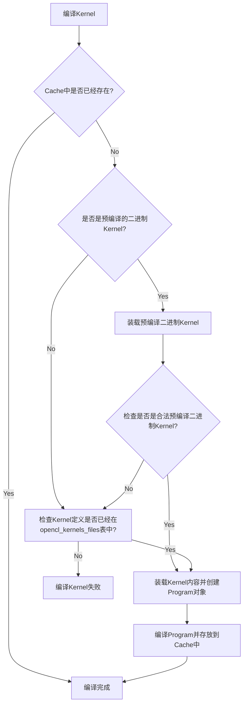

# OpenCL

## 支持的AI网络

当前OpenCL支持22个网络，如下所示：

- MobileNetV1
- MobileNetV2
- MobileNetV3_large
- MobileNetV3_small
- EfficientNetB0
- ResNet18
- ResNet50
- VGG16
- VGG19
- SSD-MobileNetV3-large
- ch_ppocr_mobile_v2.0_cls_infer
- ch_ppocr_mobile_v2.0_det_infer
- ch_ppocr_mobile_v2.0_rec_infer
- DB
- inference_dnn
- Deeplabv3
- UNet
- bisenet
- fastscnn
- bisenet_v2
- FaceBoxes
- MTCNN


## 支持的AI算子

当前支持86个OpenCl算子，如下所示：

- abs
- acos
- arg_max
- asin
- atan
- batch_norm
- bilinear_interp
- bilinear_interp_v2
- box_coder
- clip
- concat
- conv2d
- conv2d_transpose
- cos
- depthwise_conv2d
- depthwise_conv2d_transpose
- dropout
- elementwise_add
- elementwise_div
- elementwise_floordiv
- elementwise_max
- elementwise_min
- elementwise_mod
- elementwise_mul
- elementwise_pow
- elementwise_sub
- exp
- expand
- fc
- flatten
- flatten2
- fusion_elementwise_add_activation
- fusion_elementwise_div_activation
- fusion_elementwise_mul_activation
- fusion_elementwise_sub_activation
- gather
- gelu
- greater_than
- grid_sampler
- hard_sigmoid
- hard_swish
- instance_norm
- io_copy
- io_copy_once
- layer_norm
- layout
- layout_once
- leaky_relu
- log
- lrn
- matmul
- matmul_v2
- nearest_interp
- nearest_interp_v2
- pad2d
- pixel_shuffle
- pool2d
- prelu
- reduce_max
- reduce_mean
- relu
- relu6
- reshape
- reshape2
- rsqrt
- scale
- shape
- shuffle_channel
- sigmoid
- sin
- slice
- softmax
- split
- sqrt
- square
- squeeze
- squeeze2
- swish
- sync_batch_norm
- tan
- tanh
- transpose
- transpose2
- unsqueeze
- unsqueeze2
- yolo_box


## Paddle-Lite v2.11的算子

合计250个算子（包含融合算子），OpenCL支持86个。

| 算子名                            | 是否支持OpenCL |
| --------------------------------- | -------------- |
| abs                               | Y              |
| acos                              | Y              |
| affine_channel                    | N              |
| affine_grid                       | N              |
| anchor_generator                  | N              |
| arg_max                           | Y              |
| arg_min                           | N              |
| argsort                           | N              |
| asin                              | Y              |
| assign                            | N              |
| assign_value                      | N              |
| atan                              | Y              |
| attention_padding_mask            | N              |
| axpy                              | N              |
| batch_norm                        | Y              |
| beam_search                       | N              |
| beam_search_decode                | N              |
| bilinear_interp                   | Y              |
| bilinear_interp_v2                | Y              |
| box_clip                          | N              |
| box_coder                         | Y              |
| calib                             | N              |
| calib_once                        | N              |
| cast                              | N              |
| clip                              | Y              |
| collect_fpn_proposals             | N              |
| concat                            | Y              |
| conditional_block                 | N              |
| conv2d                            | Y              |
| conv2d_transpose                  | Y              |
| conv3d                            | N              |
| correlation                       | N              |
| cos                               | Y              |
| cos_sim                           | N              |
| crf_decoding                      | N              |
| crop                              | N              |
| crop_tensor                       | N              |
| ctc_align                         | N              |
| cumsum                            | N              |
| decode_bboxes                     | N              |
| deformable_conv                   | N              |
| density_prior_box                 | N              |
| depthwise_conv2d                  | Y              |
| depthwise_conv2d_transpose        | Y              |
| dequantize_linear                 | N              |
| distribute_fpn_proposals          | N              |
| dropout                           | Y              |
| elementwise_add                   | Y              |
| elementwise_div                   | Y              |
| elementwise_floordiv              | Y              |
| elementwise_max                   | Y              |
| elementwise_min                   | Y              |
| elementwise_mod                   | Y              |
| elementwise_mul                   | Y              |
| elementwise_pow                   | Y              |
| elementwise_sub                   | Y              |
| elu                               | N              |
| equal                             | N              |
| erf                               | N              |
| exp                               | Y              |
| expand                            | Y              |
| expand_as                         | N              |
| expand_v2                         | N              |
| fc                                | Y              |
| feed                              | N              |
| fetch                             | N              |
| fill_any_like                     | N              |
| fill_constant                     | N              |
| fill_constant_batch_size_like     | N              |
| fill_zeros_like                   | N              |
| flatten                           | Y              |
| flatten2                          | Y              |
| flatten_contiguous_range          | N              |
| flip                              | N              |
| floor                             | N              |
| fusion_elementwise_add_activation | Y              |
| fusion_elementwise_div_activation | Y              |
| fusion_elementwise_max_activation | N              |
| fusion_elementwise_min_activation | N              |
| fusion_elementwise_mul_activation | Y              |
| fusion_elementwise_pow_activation | N              |
| fusion_elementwise_sub_activation | Y              |
| gather                            | Y              |
| gather_nd                         | N              |
| gather_tree                       | N              |
| gaussian_random                   | N              |
| gelu                              | Y              |
| generate_proposals                | N              |
| generate_proposals_v2             | N              |
| greater_equal                     | N              |
| greater_than                      | Y              |
| grid_sampler                      | Y              |
| group_norm                        | N              |
| gru                               | N              |
| gru_unit                          | N              |
| hard_sigmoid                      | Y              |
| hard_swish                        | Y              |
| im2sequence                       | N              |
| increment                         | N              |
| index_select                      | N              |
| instance_norm                     | Y              |
| inverse                           | N              |
| io_copy                           | Y              |
| io_copy_once                      | Y              |
| is_empty                          | N              |
| layer_norm                        | Y              |
| layout                            | Y              |
| layout_once                       | Y              |
| leaky_relu                        | Y              |
| less_equal                        | N              |
| less_than                         | N              |
| linspace                          | N              |
| lod_array_length                  | N              |
| lod_reset                         | N              |
| log                               | Y              |
| log_softmax                       | N              |
| logical_and                       | N              |
| logical_not                       | N              |
| logical_or                        | N              |
| logical_xor                       | N              |
| lookup_table                      | N              |
| lookup_table_dequant              | N              |
| lookup_table_v2                   | N              |
| lrn                               | Y              |
| lstm                              | N              |
| match_matrix_tensor               | N              |
| matmul                            | Y              |
| matmul_v2                         | Y              |
| matrix_nms                        | N              |
| max_pool2d_with_index             | N              |
| mean                              | N              |
| merge_lod_tensor                  | N              |
| meshgrid                          | N              |
| mish                              | N              |
| mul                               | N              |
| multiclass_nms                    | N              |
| multiclass_nms2                   | N              |
| multiclass_nms3                   | N              |
| nearest_interp                    | Y              |
| nearest_interp_v2                 | Y              |
| negative                          | N              |
| norm                              | N              |
| not_equal                         | N              |
| one_hot                           | N              |
| one_hot_v2                        | N              |
| p_norm                            | N              |
| pad2d                             | Y              |
| pad3d                             | N              |
| pixel_shuffle                     | Y              |
| polygon_box_transform             | N              |
| pool2d                            | Y              |
| pow                               | N              |
| prelu                             | Y              |
| print                             | N              |
| prior_box                         | N              |
| quantize_linear                   | N              |
| range                             | N              |
| read_from_array                   | N              |
| reciprocal                        | N              |
| reduce_all                        | N              |
| reduce_any                        | N              |
| reduce_max                        | Y              |
| reduce_mean                       | Y              |
| reduce_min                        | N              |
| reduce_prod                       | N              |
| reduce_sum                        | N              |
| relu                              | Y              |
| relu6                             | Y              |
| relu_clipped                      | N              |
| reshape                           | Y              |
| reshape2                          | Y              |
| retinanet_detection_output        | N              |
| reverse                           | N              |
| rnn                               | N              |
| roi_align                         | N              |
| roi_perspective_transform         | N              |
| rsqrt                             | Y              |
| sampling_id                       | N              |
| scale                             | Y              |
| scatter                           | N              |
| scatter_nd_add                    | N              |
| search_aligned_mat_mul            | N              |
| search_attention_padding_mask     | N              |
| search_fc                         | N              |
| search_grnn                       | N              |
| search_group_padding              | N              |
| search_seq_arithmetic             | N              |
| search_seq_depadding              | N              |
| search_seq_fc                     | N              |
| search_seq_softmax                | N              |
| select_input                      | N              |
| sequence_arithmetic               | N              |
| sequence_concat                   | N              |
| sequence_conv                     | N              |
| sequence_expand                   | N              |
| sequence_expand_as                | N              |
| sequence_mask                     | N              |
| sequence_pad                      | N              |
| sequence_pool                     | N              |
| sequence_reshape                  | N              |
| sequence_reverse                  | N              |
| sequence_softmax                  | N              |
| sequence_topk_avg_pooling         | N              |
| sequence_unpad                    | N              |
| shape                             | Y              |
| shuffle_channel                   | Y              |
| sigmoid                           | Y              |
| sign                              | N              |
| sin                               | Y              |
| slice                             | Y              |
| softmax                           | Y              |
| softplus                          | N              |
| softsign                          | N              |
| sparse_conv2d                     | N              |
| split                             | Y              |
| split_lod_tensor                  | N              |
| sqrt                              | Y              |
| square                            | Y              |
| squeeze                           | Y              |
| squeeze2                          | Y              |
| stack                             | N              |
| strided_slice                     | N              |
| subgraph                          | N              |
| sum                               | N              |
| swish                             | Y              |
| sync_batch_norm                   | Y              |
| tan                               | Y              |
| tanh                              | Y              |
| tensor_array_to_tensor            | N              |
| thresholded_relu                  | N              |
| tile                              | N              |
| top_k                             | N              |
| top_k_v2                          | N              |
| transpose                         | Y              |
| transpose2                        | Y              |
| tril_triu                         | N              |
| unbind                            | N              |
| unfold                            | N              |
| uniform_random                    | N              |
| unique_with_counts                | N              |
| unsqueeze                         | Y              |
| unsqueeze2                        | Y              |
| unstack                           | N              |
| var_conv_2d                       | N              |
| where                             | N              |
| where_index                       | N              |
| while                             | N              |
| write_back                        | N              |
| write_to_array                    | N              |
| yolo_box                          | Y              |

## OpenCL Kernel组织结构

### 目录结构

`cl_common.h`是一个公用的头文件，每个`*.cl`文件中都会有`#include <cl_common.h>`

- buffer：包含**12**个Kernels

- image：**58**个Kernels

  合计**70**个Kernels

```bash
Paddle-Lite\lite\backends\opencl\cl_kernel
|   cl_common.h
|
+---buffer
|       concat_kernel.cl
|       depthwise_conv2d_kernel.cl
|       elementwise_add_kernel.cl
|       fc_kernel.cl
|       im2col_kernel.cl
|       mat_mul_kernel.cl
|       pool_kernel.cl
|       relu_kernel.cl
|       sigmoid_kernel.cl
|       slice_kernel.cl
|       transpose_kernel.cl
|       yolo_box_kernel.cl
|
\---image
        activation_kernel.cl
        argmax_kernel.cl
        batch_norm_kernel.cl
        bilinear_interp_kernel.cl
        box_coder_kernel.cl
        channel_add_kernel.cl
        clip_kernel.cl
        concat_default_kernel.cl
        concat_kernel.cl
        conv2d_1x1_default_kernel.cl
        conv2d_1x1_default_mali_kernel.cl
        conv2d_1x1_opt_kernel.cl
        conv2d_3x3_default_kernel.cl
        conv2d_3x3_kernel.cl
        conv2d_5x5_kernel.cl
        conv2d_5x5_opt_kernel.cl
        conv2d_7x7_kernel.cl
        conv2d_7x7_opt_kernel.cl
        conv2d_common_kernel.cl
        conv2d_transpose_kernel.cl
        conv2d_winograd_3x3s1_kernel.cl
        depthwise_conv2d_basic_kernel.cl
        depthwise_conv2d_kernel.cl
        depthwise_conv2d_transpose_kernel.cl
        dropout_kernel.cl
        elementwise_add_kernel.cl
        elementwise_broadcast_kernel.cl
        elementwise_kernel.cl
        elementwise_mul_kernel.cl
        elementwise_sub_kernel.cl
        expand_kernel.cl
        fc_kernel.cl
        gather_kernel.cl
        greater_than_kernel.cl
        grid_sampler_kernel.cl
        instance_norm_kernel.cl
        layer_norm_kernel.cl
        layout_kernel.cl
        lrn_kernel.cl
        matmul_kernel.cl
        matmul_opt_kernel.cl
        matmul_unpersistable_y_kernel.cl
        matmul_xtranspose_kernel.cl
        max_kernel.cl
        nearest_interp_kernel.cl
        pad2d_kernel.cl
        pixel_shuffle_kernel.cl
        pool_deprecated_kernel.cl
        pool_kernel.cl
        reduce_kernel.cl
        reshape_kernel.cl
        scale_kernel.cl
        shuffle_channel_kernel.cl
        slice_kernel.cl
        softmax_kernel.cl
        split_kernel.cl
        transpose_kernel.cl
        trigonometric_kernel.cl
```

### opencl_kernels_files查询表

在编译Paddle-Lite时，Paddle-Lite会通过`lite/tools/cmake_tools/gen_opencl_code.py`工具将上述所有支持的Kernels文件制作成一张`opencl_kernels_files`查询表，将它存在在`lite/backends/opencl/opencl_kernels_source.cc`文件中，一般的命令行如下所示：

```bash
$ python3 lite/tools/cmake_tools/gen_opencl_code.py lite/backends/opencl/cl_kernel lite/backends/opencl/opencl_kernels_source.cc
```

`opencl_kernels_source.cc`中的`opencl_kernels_files`定义样式如下:

```c++
extern const std::map<std::string, std::vector<unsigned char>> opencl_kernels_files = {
    {"buffer/concat_kernel.cl", {0x23, 0x70, 0x72, 0x61, ...},
    {"buffer/depthwise_conv2d_kernel.cl", {0x23, 0x70, 0x72,...},
    ...
    {"image/matmul_kernel.cl", {0x23, 0x70, 0x72, 0x61, ...},
    ...
}
```

在`CLRuntime::CreateProgramFromSource(..., file_name, ...)`运行的时候会根据文件名，比如说`file_name="image/argmax_kernel.cl"`从`opencl_kernels_files`中获取它的kernel内容来创建`cl::Program`对象，详情可以参见：`lite/backends/opencl/cl_runtime.cc`第332行`CLRuntime::CreateProgramFromSource()`。

### OpenCL Kernel编译

在编译OpenCL的Kernel时候，为提高性能，会依次使用Cache，预编译二进制Kernel和源代码Kernel进行编译，算法如下图1所示



​                                              图1 编译OpenCL Kernel算法

**注意**

- 预编译二进制Kernel文件可以通过`CLRuntime::SetBinaryPathName(const std::string& path, const std::string& name)`来设置，在推断C/C++程序中，可以通过上层接口函数`MobileConfig::set_opencl_binary_path_name(const std::string &path, const std::string &name)`或者`CxxConfig::set_opencl_binary_path_name(const std::string &path, const std::string &name)`来进行配置。

- 预编译二进制Kernel文件需要校验`sn_key`，默认值为`lite_opencl_precompiled_binary_identifier`，对应的`value`中依次存放

  1. aarch_info
  2. lite_version
  3. build_options
  4. platform_info
  5. device_version
  6. driver_version
  7. string("place_holder")

  具体实现详见`CLRuntime::GetSN(const std::string options)`（第485行），这个实现的定义实现中有很奇怪的代码，如下所示

  ```c++
    const std::string aarch =
  #if defined(__aarch64__)
        "android_armv8";
  #else
        "android_armv7";
  #endif
  #if defined(_WIN64)
    "win64";
  #elif defined(_WIN32)
    "win32";
  #endif
  ```

  在非Windows平台，arch要么是android_armv8，那么是android_armv7，这个应该没什么问题，但是在Windows平台，它在后面会多出一个win64或者win32，代码能过？

  在使用GetSN的时候（第251行），如下

  ```
  ...
        } else if (host::memcmp(((sn_iter->second)[0]).data(),
                                GetSN(precision_option).data(),
                                GetSN(precision_option).length())) {
          std::string sn_str(reinterpret_cast<char*>((sn_iter->second)[0].data()),
                             (sn_iter->second)[0].size());
          LOG(INFO) << "\nSN required: " << GetSN(precision_option)
                    << "\tsize: " << GetSN(precision_option).length()
                    << "\nSN in bin file: " << sn_str
                    << "\tsize: " << ((sn_iter->second)[0]).size();
          LOG(WARNING) << "The precompiled OpenCL binary[" << bin_file
                       << "] is invalid!";
  ...
  ```

  `GetSN(precision_option)`的N次调用的意义就是为了让代码写起来简单一些？可能编译器足够强大，这种代码能够被很好的优化吧？

- 装载一次二进制Kernel文件后，逻辑上网络所需要的Kernels都已经编译Ready并存放在Cache中了，那么对于使用它们性能将会有很大的提高。从这个角度看，可以把网络需要的Kernels在运行之前先制作好一份二进制Kernel文件，然后运行前加载一次即可，它是一个手工活，需要工具配合。如果我们查看Paddle-Lite源代码的话，我们会发现

  - 在`CLRuntime::SaveProgram()`（cl_runtime.cc第364行）能够保存运行过的Kernels

  - 在`RuntimeProgram::~RuntimeProgram()`（program.h第218行）能够保存CLRuntime的两个重要数据

    ```c++
        // save program kernel cache & tuned params
        CLRuntime::Global()->SaveProgram();
        CLRuntime::Global()->SaveTuned();
    ```

  - `light_api.h`（第141行）定义了`std::unique_ptr<RuntimeProgram> program_`，所以只要使用`MobileConfig`创建`LightPredictor`，运行一下网络后正常退出即可。**切记**：`MobileConfig::set_opencl_binary_path_name(const std::string& path, const std::string& name)`必须被设置，否则无保存路径！为了方便起见，我使用python代码来完成上面的任务，如下：

    ```python
    from paddlelite import lite
    
    config = lite.MobileConfig()
    config.set_model_from_file("mobilenet_v1_opencl.nb")
    config.set_opencl_binary_path_name("./opencl_kernel", "kernel_binary")
    predictor = lite.create_paddle_predictor(config)
    
    import numpy as np
    from PIL import Image
    
    img = (
        (
            np.asarray(Image.open("cat.jpg").crop((200, 0, 1400, 1200)).resize((224, 224)))
            / 255.0
        )
        .astype(np.float32)
        .transpose((2, 0, 1))[np.newaxis, ...]
    )
    
    input_tensor = predictor.get_input(0)
    input_tensor.from_numpy(img)
    predictor.run()
    out = predictor.get_output(0).numpy()
    
    with open("synset.txt", "r", encoding="utf-8") as f:
        labels = np.array([line.strip() for line in f if line.strip()])
    
    from scipy.special import softmax
    
    out = softmax(out, axis=-1)
    o_index = out.argsort(axis=-1)[..., -5:][..., ::-1]
    print(o_index.ravel(), out[..., o_index].ravel(), labels[o_index].ravel())
    ```

    `opencl_kernel`目录中存放二进制kernel文件`kernel_binary`，运行完成后

    ```bash
    $ cd opencl_kernel
    $ ls -l
    -rw-r--r-- 1 292288 kernel_binary
    ```

    如果查看`kernel_binary`的头部，那么在Windows下就会看见不正确的`android_armv7`信息出现

    ```bash
    $ cat kernel_binary | head -2
    ╝□□╝  H□╚□@╚□□h□ □□□}□╝□□□╝4)lite_opencl_precompiled_binary_identifier□□□╝kandroid_armv7; a404b451c; Precision: FP
    32; NVIDIA CUDA, FULL_PROFILE; OpenCL 1.2 CUDA; 457.09; place_holder□□□╝peimage/softmax_kernel.cl -cl-fast-relaxed-math -cl-mad-
    enable -DCL_DTYPE_float -DCL_DTYPE_FLOAT_FORCE z□□╝>|//
    // Generated by NVIDIA NVVM Compiler
    ```


## 参考

- [Github Paddle-Lite](https://github.com/PaddlePaddle/Paddle-Lite)
- [Paddle-Lite Models Supported](https://paddle-lite.readthedocs.io/zh/latest/quick_start/support_model_list.html)
- [Paddle-Lite Operators Supported](https://paddle-lite.readthedocs.io/zh/latest/quick_start/support_operation_list.html)