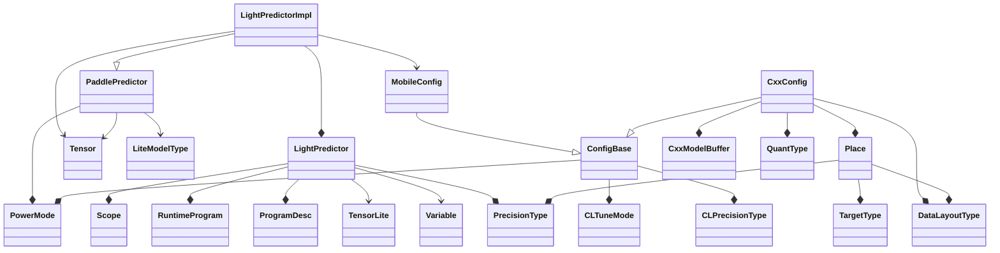
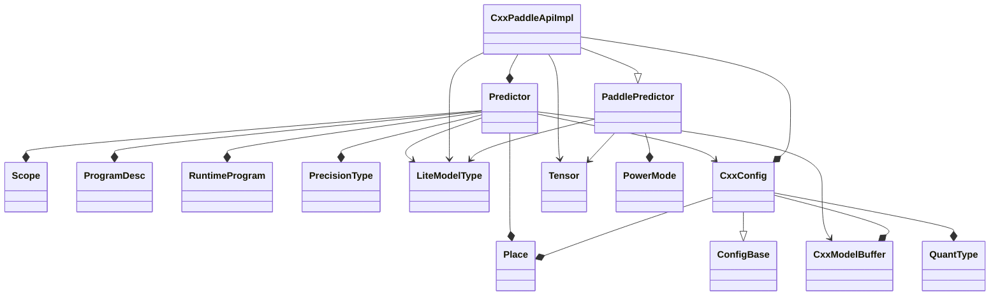

# Paddle-Lite

## Architecture


​                                                   图1 Paddle-Lite框架


## Paddlelite Inference

### LightPredictor类关系图



**source**: `lite/api/light_api.h`


### Predictor类关系图



**source**: `lite/api/cxx_api.h`


### Python类与C++类映射关系

| Python类        | C++类              |
| --------------- | ------------------ |
| Opt             | OptBase            |
| CxxPredictor    | CxxPaddleApiImpl   |
| LightPredictor  | LightPredictorImpl |
| CxxConfig       | CxxConfig          |
| MobileConfig    | MobileConfig       |
| PowerMode       | PowerMode          |
| CLTuneMode      | CLTuneMode         |
| CLPrecisionType | CLPrecisionType    |
| PrecisionType   | PrecisionType      |
| MLUCoreVersion  | MLUCoreVersion     |
| TargetType      | TargetType         |
| DataLayoutType  | DataLayoutType     |
| Place           | Place              |
| Tensor          | Tensor             |

**source**: `lite/api/python/pybind/pybind.cc`


### Python函数与C++函数映射关系

```c++
#ifndef LITE_ON_TINY_PUBLISH
  m->def("create_paddle_predictor",
         [](const CxxConfig &config) -> std::unique_ptr<CxxPaddleApiImpl> {
           auto x = std::unique_ptr<CxxPaddleApiImpl>(new CxxPaddleApiImpl());
           x->Init(config);
           return std::move(x);
         });
#endif
  m->def("create_paddle_predictor",
         [](const MobileConfig &config) -> std::unique_ptr<LightPredictorImpl> {
           auto x =
               std::unique_ptr<LightPredictorImpl>(new LightPredictorImpl());
           x->Init(config);
           return std::move(x);
         });
```

这个Python的实现与C/C++实现还是有所区别的，因为编写C/C++推断程序的时候，我们是通过以下模板函数来创建预测器的

```c++
template <typename ConfigT>
LITE_API std::shared_ptr<PaddlePredictor> CreatePaddlePredictor(const ConfigT&);
```


**light api中的实现**

```c++
namespace lite_api {

template <>
std::shared_ptr<PaddlePredictor> CreatePaddlePredictor(
    const MobileConfig& config) {
  auto x = std::make_shared<lite::LightPredictorImpl>();
  x->Init(config);
  return x;
}

}  // namespace lite_api
```


**cxx api中的实现**

```c++
namespace lite_api {

template <>
std::shared_ptr<PaddlePredictor> CreatePaddlePredictor(
    const CxxConfig &config) {
  static std::mutex mutex_conf;
  std::unique_lock<std::mutex> lck(mutex_conf);
  auto x = std::make_shared<lite::CxxPaddleApiImpl>();
  x->Init(config);
  return x;
}

}  // namespace lite_api
```

**区别**

- C/C++中使用了锁保护，而Python中没有
- C/C++使用了`std::shared_ptr`而Python中使用了`std::unique_ptr`
- C/C++返回的是`PaddlePredictor`，而Python中返回的是`CxxPaddleApiImpl`或者`LightPredictorImpl`。从类关系图看，`PaddlePredictor`是`CxxPaddleApiImpl`和`LightPredictorImpl`的父类，这个可能是pybind11功能限制导致的差异。


### Pybind11绑定方法

上面的类与函数对应的映射关系，通过`lite/api/python/pybind/pybind.h`中的如下方式建立关系

```
PYBIND11_MODULE(lite, m) {
  m.doc() = "C++ core of Paddle-Lite";

  BindLiteApi(&m);
#ifndef LITE_ON_TINY_PUBLISH
  BindLiteOpt(&m);
#endif
}
```


### Paddle-Lite编译

#### Windows

```bash
$ lite\tools\build_windows.bat ^
	use_vs2017 ^
	with_profile ^
	with_precision_profile ^
	with_extra ^
	with_static_mkl ^
	with_opencl
```

#### Linux

```bash
$ lite/tools/build_linux.sh --arch=x86 \
	--toolchain=gcc \
	--with_extra=ON \
	--with_python=ON \
	--python_version=3.7 \
	--with_log=ON \
	--with_exception=ON \
	--with_profile=ON \
	--with_precision_profile=ON \
	--with_static_mkl=ON \
	--with_avx=ON \
	--with_opencl=ON \
	full_publish
```


### Paddle-Lite 发布结构

```bash
inference_lite_lib
+---bin
|       test_model_bin.exe
|
+---cxx
|   +---include
|   |       paddle_api.h
|   |       paddle_lite_factory_helper.h
|   |       paddle_place.h
|   |       paddle_use_kernels.h
|   |       paddle_use_ops.h
|   |       paddle_use_passes.h
|   |
|   \---lib
|           libpaddle_api_full_bundled.lib
|           libpaddle_api_light_bundled.lib
|
+---demo
|   +---cxx
|   |   +---mobilenetv1_full
|   |   |       build.bat
|   |   |       build.sh
|   |   |       CMakeLists.txt
|   |   |       mobilenet_full_api.cc
|   |   |
|   |   \---mobilenetv1_light
|   |           build.bat
|   |           build.sh
|   |           CMakeLists.txt
|   |           mobilenet_light_api.cc
|   |
|   \---python
|           mobilenetv1_full_api.py
|           mobilenetv1_light_api.py
|
+---python
|   +---install
|   |   |   setup.py
|   |   |
|   |   +---build
|   |   |   +---bdist.win-amd64
|   |   |   +---lib.win-amd64-3.7
|   |   |   |   \---paddlelite
|   |   |   |           lite.pyd
|   |   |   |           __init__.py
|   |   |   |
|   |   |   \---scripts-3.7
|   |   |           paddle_lite_opt
|   |   |
|   |   +---dist
|   |   |       paddlelite-c914ca88a-cp37-cp37m-win_amd64.whl
|   |   |
|   |   +---libs
|   |   +---lite
|   |   |       lite.pyd
|   |   |       paddle_lite_opt
|   |   |       __init__.py
|   |   |
|   |   \---paddlelite.egg-info
|   |           dependency_links.txt
|   |           PKG-INFO
|   |           SOURCES.txt
|   |           top_level.txt
|   |
|   \---lib
|           lite.pyd
|
\---third_party
    \---mklml
        +---include
        |       i_malloc.h
        |       mkl.h
        |       mkl_blas.h
        |       mkl_cblas.h
        |       mkl_direct_blas.h
        |       mkl_direct_blas_kernels.h
        |       mkl_direct_call.h
        |       mkl_direct_lapack.h
        |       mkl_direct_types.h
        |       mkl_dnn.h
        |       mkl_dnn_types.h
        |       mkl_lapack.h
        |       mkl_lapacke.h
        |       mkl_service.h
        |       mkl_trans.h
        |       mkl_types.h
        |       mkl_version.h
        |       mkl_vml.h
        |       mkl_vml_defines.h
        |       mkl_vml_functions.h
        |       mkl_vml_types.h
        |       mkl_vsl.h
        |       mkl_vsl_defines.h
        |       mkl_vsl_functions.h
        |       mkl_vsl_types.h
        |
        \---lib
                libiomp5md.dll
                libiomp5md.lib
                mkl_core.lib
                mkl_intel_lp64.lib
                mkl_intel_thread.lib
```


## Paddle-Lite重要组件

### [OpenCL](https://github.com/SNSerHello/MyNotes/blob/main/paddlelite/OpenCL.md)


### NNAdapter

- #### [Imagination NNA](https://github.com/SNSerHello/MyNotes/blob/main/paddlelite/Imagination%20NNA.md)


## 参考

- [Imagination NNA](https://github.com/SNSerHello/MyNotes/blob/main/paddlelite/Imagination%20NNA.md)
- [OpenCL](https://github.com/SNSerHello/MyNotes/blob/main/paddlelite/OpenCL.md)
- [SNSerHello/Paddle-Lite](https://github.com/SNSerHello/Paddle-Lite)