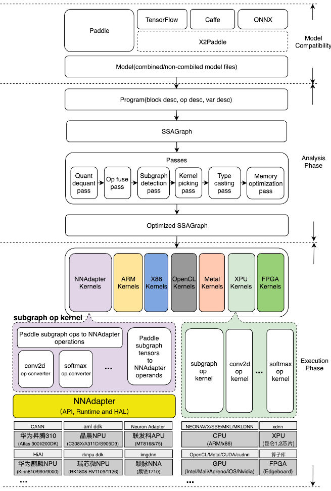
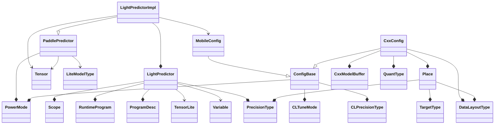

# Paddle-Lite

## Architecture



​                                                   图1 Paddle-Lite框架


## Paddlelite Inference

### LightPredictor类关系图



**source**: `lite/api/light_api.h`


### Predictor类关系图


**source**: `lite/api/cxx_api.h`


### Python类与C++类映射关系

| Python类        | C++类              |
| --------------- | ------------------ |
| Opt             | OptBase            |
| CxxPredictor    | CxxPaddleApiImpl   |
| LightPredictor  | LightPredictorImpl |
| CxxConfig       | CxxConfig          |
| MobileConfig    | MobileConfig       |
| PowerMode       | PowerMode          |
| CLTuneMode      | CLTuneMode         |
| CLPrecisionType | CLPrecisionType    |
| PrecisionType   | PrecisionType      |
| MLUCoreVersion  | MLUCoreVersion     |
| TargetType      | TargetType         |
| DataLayoutType  | DataLayoutType     |
| Place           | Place              |
| Tensor          | Tensor             |

**source**: `lite/api/python/pybind/pybind.cc`


### Python函数与C++函数映射关系

```c++
#ifndef LITE_ON_TINY_PUBLISH
  m->def("create_paddle_predictor",
         [](const CxxConfig &config) -> std::unique_ptr<CxxPaddleApiImpl> {
           auto x = std::unique_ptr<CxxPaddleApiImpl>(new CxxPaddleApiImpl());
           x->Init(config);
           return std::move(x);
         });
#endif
  m->def("create_paddle_predictor",
         [](const MobileConfig &config) -> std::unique_ptr<LightPredictorImpl> {
           auto x =
               std::unique_ptr<LightPredictorImpl>(new LightPredictorImpl());
           x->Init(config);
           return std::move(x);
         });
```

这个Python的实现与C/C++实现还是有所区别的，因为编写C/C++推断程序的时候，我们是通过以下模板函数来创建预测器的

```c++
template <typename ConfigT>
LITE_API std::shared_ptr<PaddlePredictor> CreatePaddlePredictor(const ConfigT&);
```


**light api中的实现**

```c++
namespace lite_api {

template <>
std::shared_ptr<PaddlePredictor> CreatePaddlePredictor(
    const MobileConfig& config) {
  auto x = std::make_shared<lite::LightPredictorImpl>();
  x->Init(config);
  return x;
}

}  // namespace lite_api
```


**cxx api中的实现**

```c++
namespace lite_api {

template <>
std::shared_ptr<PaddlePredictor> CreatePaddlePredictor(
    const CxxConfig &config) {
  static std::mutex mutex_conf;
  std::unique_lock<std::mutex> lck(mutex_conf);
  auto x = std::make_shared<lite::CxxPaddleApiImpl>();
  x->Init(config);
  return x;
}

}  // namespace lite_api
```

**区别**

- C/C++中使用了锁保护，而Python中没有
- C/C++使用了`std::shared_ptr`而Python中使用了`std::unique_ptr`
- C/C++返回的是`PaddlePredictor`，而Python中返回的是`CxxPaddleApiImpl`或者`LightPredictorImpl`。从类关系图看，`PaddlePredictor`是`CxxPaddleApiImpl`和`LightPredictorImpl`的父类，这个可能是pybind11功能限制导致的差异。


### Pybind11绑定方法

上面的类与函数对应的映射关系，通过`lite/api/python/pybind/pybind.h`中的如下方式建立关系

```
PYBIND11_MODULE(lite, m) {
  m.doc() = "C++ core of Paddle-Lite";

  BindLiteApi(&m);
#ifndef LITE_ON_TINY_PUBLISH
  BindLiteOpt(&m);
#endif
}
```


### Paddle-Lite编译

#### Windows

```bash
$ lite\tools\build_windows.bat ^
	use_vs2017 ^
	with_profile ^
	with_precision_profile ^
	with_extra ^
	with_static_mkl ^
	with_opencl
```

#### Linux

```bash
$ lite/tools/build_linux.sh --arch=x86 \
	--toolchain=gcc \
	--with_extra=ON \
	--with_python=ON \
	--python_version=3.7 \
	--with_log=ON \
	--with_exception=ON \
	--with_profile=ON \
	--with_precision_profile=ON \
	--with_static_mkl=ON \
	--with_avx=ON \
	--with_opencl=ON \
	full_publish
```


### Paddle-Lite 发布结构

```bash
inference_lite_lib
+---bin
|       test_model_bin.exe
|
+---cxx
|   +---include
|   |       paddle_api.h
|   |       paddle_lite_factory_helper.h
|   |       paddle_place.h
|   |       paddle_use_kernels.h
|   |       paddle_use_ops.h
|   |       paddle_use_passes.h
|   |
|   \---lib
|           libpaddle_api_full_bundled.lib
|           libpaddle_api_light_bundled.lib
|
+---demo
|   +---cxx
|   |   +---mobilenetv1_full
|   |   |       build.bat
|   |   |       build.sh
|   |   |       CMakeLists.txt
|   |   |       mobilenet_full_api.cc
|   |   |
|   |   \---mobilenetv1_light
|   |           build.bat
|   |           build.sh
|   |           CMakeLists.txt
|   |           mobilenet_light_api.cc
|   |
|   \---python
|           mobilenetv1_full_api.py
|           mobilenetv1_light_api.py
|
+---python
|   +---install
|   |   |   setup.py
|   |   |
|   |   +---build
|   |   |   +---bdist.win-amd64
|   |   |   +---lib.win-amd64-3.7
|   |   |   |   \---paddlelite
|   |   |   |           lite.pyd
|   |   |   |           __init__.py
|   |   |   |
|   |   |   \---scripts-3.7
|   |   |           paddle_lite_opt
|   |   |
|   |   +---dist
|   |   |       paddlelite-c914ca88a-cp37-cp37m-win_amd64.whl
|   |   |
|   |   +---libs
|   |   +---lite
|   |   |       lite.pyd
|   |   |       paddle_lite_opt
|   |   |       __init__.py
|   |   |
|   |   \---paddlelite.egg-info
|   |           dependency_links.txt
|   |           PKG-INFO
|   |           SOURCES.txt
|   |           top_level.txt
|   |
|   \---lib
|           lite.pyd
|
\---third_party
    \---mklml
        +---include
        |       i_malloc.h
        |       mkl.h
        |       mkl_blas.h
        |       mkl_cblas.h
        |       mkl_direct_blas.h
        |       mkl_direct_blas_kernels.h
        |       mkl_direct_call.h
        |       mkl_direct_lapack.h
        |       mkl_direct_types.h
        |       mkl_dnn.h
        |       mkl_dnn_types.h
        |       mkl_lapack.h
        |       mkl_lapacke.h
        |       mkl_service.h
        |       mkl_trans.h
        |       mkl_types.h
        |       mkl_version.h
        |       mkl_vml.h
        |       mkl_vml_defines.h
        |       mkl_vml_functions.h
        |       mkl_vml_types.h
        |       mkl_vsl.h
        |       mkl_vsl_defines.h
        |       mkl_vsl_functions.h
        |       mkl_vsl_types.h
        |
        \---lib
                libiomp5md.dll
                libiomp5md.lib
                mkl_core.lib
                mkl_intel_lp64.lib
                mkl_intel_thread.lib
```


## Paddle-Lite算子开发

以下内容以CNN网络中最常见的`Conv2d`算子做为例子，展现如何在Paddle-Lite中开发新算子。

1. 在`lite/operators`目录下创建新算子的头文件和C/C++元文件，比如说`Conv2d`的头文件为`lite/operators/conv_op.h`，C/C++源文件为`lite/operators/conv_op.cc`。每个算子都需要继承OpLite类，它的类关系图如下所示

   ```mermaid
   classDiagram
   	class ConvOpLite {
   		+CheckShape() bool
   		+InferShapeImpl() bool
   		+AttachImpl() bool
   		+DebugString() string
   		+...(...)
   	}
   	class OpLite {
   		+Run() bool
   		+Attach(...) bool
   		+InferShape() bool
   		+...(...)
   	}
   	class Registry {
   		+Touch() void
   	}
   	ConvOpLite --|> OpLite
   	ConvOpLite --* ConvParam
   	ConvOpLite --> OpCharacter
   	ConvOpLite --> op_desc
   	ConvOpLite --> Scope
   	
   	ConvParam --|> ParamBase
   	ConvParam --* Tensor
   
   	OpLite --|> Registry
   ```

   **其中**：

   - ConvOpLite是`Conv2d`的实现类，它实现了三个重要方法（Debugging部分不算）
     - CheckShape()，执行期运行，仅仅做input的shape有效性检查之用，一般用于debugging时期。
     - InferShapeImpl()，运行期运行，由OpLite::InferShape()激活，将`Conv2d`输出shape计算出来，一般是用于网络shape推断。
     - AttachImpl()，分析期运行，由OpLite::Attach()激活，将ConvParam中的内容正确的安置好
     - DebugString()，一般仅仅用于debugging时期
   - OpLite::Run()是将算子Kernel的Lauch()激活，真正进行算子计算工作。

   **已经实现的新算子还需要做两部分工作**

   - 通过`REGISTER_LITE_OP`将新算子注册，比如说`REGISTER_LITE_OP(conv2d, paddle::lite::operators::ConvOpLite)`将`Conv2d`算子注册入系统中去。

     ```c++
     #define REGISTER_LITE_OP(op_type__, OpClass)                                   \
       static paddle::lite::OpLiteRegistrar op_type__##__registry(                  \
           #op_type__, []() {                                                       \
             return std::unique_ptr<paddle::lite::OpLite>(new OpClass(#op_type__)); \
           });                                                                      \
       int touch_op_##op_type__() {                                                 \
         op_type__##__registry.touch();                                             \
         OpKernelInfoCollector::Global().AddOp2path(#op_type__, __FILE__);          \
         return 0;                                                                  \
       }
     ```

     `REGISTER_LITE_OP`注册方法分两步

     1. 定义一个静态`paddle::lite::OpLiteRegistrar`变量和一个`touch_op_`开头的函数，在这个函数中它调用新定义的静态`paddle::lite::OpLiteRegistrar`变量touch()方法，并通过`OpKernelInfoCollector::AddOp2path()`函数将它的新算子的名字与路径注册到`OpLiteFactory`的一个全局实例中去。

     2. `USE_LITE_OP`将会激活`touch_op_`开头的函数，来完成整个注册工作

        ```c++
        #define USE_LITE_OP(op_type__)       \
          extern int touch_op_##op_type__(); \
          int LITE_OP_REGISTER_FAKE(op_type__) UNUSED = touch_op_##op_type__();
        ```

        这些`USE_LITE_OP`的所激活工作，都被定义在`lite/api/paddle_use_ops.h`中，并且被包含在某个C/C++源文件中进行编译与运行，比如说`lite/api/light_api_impl.cc`。

   - 在`lite/operators/CMakeLists.txt`中加入新算子文件，比如说`add_operator(conv_op basic SRCS conv_op.cc)`，这样新的算子就能够被系统编译进取啦！

2. 在`lite/kernels`下面，比如说`opencl`中，定义相关的算子Kernel实现，所有的算子Kernel都是`KernelLite`的字类，相见[OpenCL Kernel算子注册](https://github.com/SNSerHello/MyNotes/blob/main/paddlelite/OpenCL.md)，其他的后端，比如说arm，cuda，nnadapter方法类似。在完成新Kernel开发后，还需要做两件事情：

   - 使用`REGISTER_LITE_KERNEL`，将Kernel注册到系统中去，比如说

     ```c++
     REGISTER_LITE_KERNEL(conv2d,
                          kOpenCL,
                          kFloat,
                          kNCHW,
                          paddle::lite::kernels::opencl::ConvCompute,
                          def)
         .BindInput("Input", {LiteType::GetTensorTy(TARGET(kOpenCL))})
         .BindInput("Bias", {LiteType::GetTensorTy(TARGET(kOpenCL))})
         .BindInput("Filter", {LiteType::GetTensorTy(TARGET(kOpenCL))})
         .BindOutput("Output", {LiteType::GetTensorTy(TARGET(kOpenCL))})
         .Finalize();
     ```

   - 在`lite/kernels/xxx/CMakeLists.txt`中增加Kernel的实现文件，比如说`add_kernel(conv_opencl_image OPENCL basic SRCS conv_image_compute.cc)`，把它们添加到编译系统中去。

3. 单元测试

   - Kernels端
   - Operators端


## Paddle-Lite重要组件

### [OpenCL](https://github.com/SNSerHello/MyNotes/blob/main/paddlelite/OpenCL.md)


### NNAdapter

- #### [Imagination NNA](https://github.com/SNSerHello/MyNotes/blob/main/paddlelite/Imagination%20NNA.md)


## 参考

- [Imagination NNA](https://github.com/SNSerHello/MyNotes/blob/main/paddlelite/Imagination%20NNA.md)
- [OpenCL](https://github.com/SNSerHello/MyNotes/blob/main/paddlelite/OpenCL.md)
- [SNSerHello/Paddle-Lite](https://github.com/SNSerHello/Paddle-Lite)
- [Add Operation](https://github.com/SNSerHello/Paddle-Lite/blob/develop/docs/develop_guides/add_operation.md)
