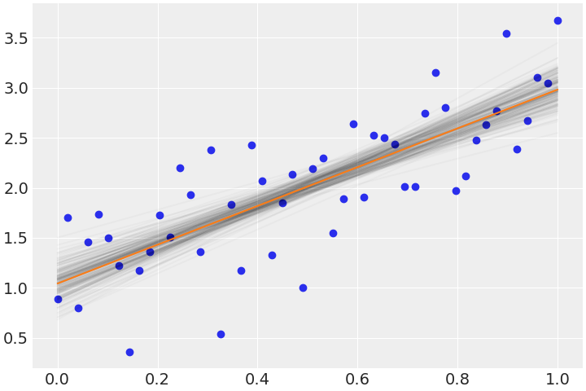

# 搭建pymc3环境

## Ubuntu20.04LTS

```
$ sudo apt install libopenblas-dev
$ conda env create --file py38-pymc3.yaml

# 配置py38-pymc3环境变量
$ conda activate py38-pymc3
$ mkdir -p $CONDA_PREFIX/etc/conda/activate.d
$ nano $CONDA_PREFIX/etc/conda/activate.d/env_vars.sh
文件内容如下：
CUDA_HOME=$CONDA_PREFIX
export LD_LIBRARY_PATH=$CUDA_HOME/lib:$LD_LIBRARY_PATH
rm ~/.theanorc
cp ~/theanorc.pymc3 ~/.theanorc
$ mkdir -p $CONDA_PREFIX/etc/conda/deactivate.d
$ nano $CONDA_PREFIX/etc/conda/deactivate.d/env_vars.sh
文件内容如下：
export LD_LIBRARY_PATH=`echo $LD_LIBRARY_PATH | cut -d : -f 2-`
$ conda deactivate
$ conda activate py38-pymc3
```

**.theanorc配置**

```
[global]
floatX = float32
device = cuda
optimizer_including = cudnn

[gcc]
cxxflags = -I/media/samba/anaconda3/envs/py38-pymc3/include -L/media/samba/anaconda3/envs/py38-pymc3/lib -L/usr/lib/x86_64-linux-gnu -lrt -pthread -lresolv

[gpuarray]
preallocate = 0

[dnn]
enabled = True
library_path = /media/samba/anaconda3/envs/py38-pymc3/lib
include_path = /media/samba/anaconda3/envs/py38-pymc3/include

[blas]
ldflags=-L/usr/lib/x86_64-linux-gnu -lopenblas -lpthread -lm

[cuda]
root = /media/samba/anaconda3/envs/py38-pymc3
include_path = /media/samba/anaconda3/envs/py38-pymc3/include

[lib]
cnmem = 0.5
```

## 在Windows中搭建pymc3环境

**前提条件**

- `cuda_10.2.89_441.22_windows.exe`被安装到`G:\CUDAv10.2`
- `Anaconda3-2020.11-Windows-x86_64.exe`被安装到`G:\Anaconda3`
- `OpenBLAS`被安装到`C:\OpenBLAS`

**安装py38-pymc3**

```
$ conda env create --file py38-pymc3-win.yaml
$ cd G:\Anaconda3\envs\py38-pymc3\Library\bin
$ ln -s nvrtc64_102_0.dll nvrtc64_70.dll
$ ln -s cublas64_10.dll cublas64_70.dll
```

**.theanrc配置**

```
[global]
floatX = float32
device = cuda
optimizer_including = cudnn

[cuda]
root = G:\CUDAv10.2\bin
include_path = G:\CUDAv10.2\include

[blas]
ldflags = -LC:\OpenBLAS\bin -lopenblas -lpthread -lm

[gpuarray]
preallocate = 0

[gcc]
cxxflags = -IG:\CUDAv10.2\include -IG:\Anaconda3\envs\py38-pymc3\Library\include -IC:\OpenBLAS\include -LG:\Anaconda3\envs\py38-pymc3\Library\lib\x64 -LC:\OpenBLAS\lib

[nvcc]
flags = -LG:\Anaconda3\envs\py38-pymc3\Library\lib\x64 --machine=64

[dnn]
enabled = True
library_path = G:\Anaconda3\envs\py38-pymc3\Library\lib\x64
include_path = G:\Anaconda3\envs\py38-pymc3\Library\include

[lib]
cnmem = 0.5
```

## 检查pymc3环境

```
import os
import arviz as az
import bambi
import matplotlib.pyplot as plt
import numpy as np
import pandas as pd
import pymc3 as pm
import theano
import xarray as xr
from numpy.random import default_rng

print(f"Running on PyMC3 v{pm.__version__}")

# %config InlineBackend.figure_format = 'retina'
# Initialize random number generator
RANDOM_SEED = 8927
rng = default_rng(RANDOM_SEED)
az.style.use("arviz-darkgrid")

size = 50
true_intercept = 1
true_slope = 2
x = np.linspace(0, 1, size)
y = true_intercept + x * true_slope + rng.normal(scale=0.5, size=size)
data = pd.DataFrame({"x": x, "y": y})

model = bambi.Model("y ~ x", data)
fitted = model.fit(draws=1000)

x_axis = xr.DataArray(np.linspace(0, 1, num=100), dims=["x_plot"])
mu_pred = fitted.posterior["Intercept"] + fitted.posterior["x"] * x_axis
mu_mean = mu_pred.mean(dim=("chain", "draw"))
mu_plot = mu_pred.stack(sample=("chain", "draw"))
random_subset = rng.permutation(np.arange(len(mu_plot.sample)))[:200]
plt.scatter(x, y)
plt.plot(x_axis, mu_plot.isel(sample=random_subset), color="black", alpha=0.025)
plt.plot(x_axis, mu_mean, color="C1")
plt.show()
```



## pymc3 GPU加速问题解决列表

1. `theano/gpuarray/__init__.py`
    解决：AttributeError: module 'theano.gpuarray.optdb' has no attribute 'add_tags'. `theano/gnuarray/optdb.py`与`theano.compile.optdb`在环境中被`import`混乱了，所以采用清晰的方法来使用，即`theano.compile.optdb`
2. `theano/gpuarray/opt.py`
    解决：TypeError: local_gpua_elemwise() missing 1 required positional argument: 'outputs'
3. `theano/gpuarray/opt.py`
    解决：TypeError: object of type 'generator' has no len()
4. `theano/link/c/basic.py`
    解决：TypeError: ('The following error happened while compiling the node', GpuElemwise{exp,no_inplace}(<GpuArrayType<None>(float32, vector)>), '\n', "__hide() got an unexpected keyword argument 'c_compiler'")
5. `theano/tensor/opt.py`
    解决：AttributeError: 'pygpu.gpuarray.GpuArray' object has no attribute 'flatten'

**补充**：当前的问题是`GpuElemwise`中的方法没有在GPU中被实现，需要后继继续修改，当前的`workaround`的方法是`device = cpu`，暂时使用CPU方案。

**CUDA运行出错样例**

```
from theano import function, config, shared, tensor as tt
import numpy
import time

vlen = 10 * 30 * 768  # 10 x #cores x # threads per core
iters = 1000

rng = numpy.random.RandomState(22)
x = shared(numpy.asarray(rng.rand(vlen), config.floatX))
f = function([], tt.exp(x))
print(f.maker.fgraph.toposort())
t0 = time.time()
for i in range(iters):
    r = f()
t1 = time.time()
print("Looping %d times took %f seconds" % (iters, t1 - t0))
print("Result is %s" % (r,))
if numpy.any(
    [
        isinstance(x.op, tt.elemwise.Elemwise) and ("Gpu" not in type(x.op).__name__)
        for x in f.maker.fgraph.toposort()
    ]
):
    print("Used the cpu")
else:
    print("Used the gpu")
```

**运行错误信息**

```
[GpuElemwise{exp,no_inplace}(<GpuArrayType<None>(float32, vector)>), HostFromGpu(gpuarray)(GpuElemwise{exp,no_inplace}.0)]
NotImplementedError: No Python implementation is provided by this Op.
Apply node that caused the error: GpuElemwise{exp,no_inplace}(<GpuArrayType<None>(float32, vector)>)
Toposort index: 0
Inputs types: [GpuArrayType<None>(float32, vector)]
Inputs shapes: [(230400,)]
Inputs strides: [(4,)]
Inputs values: ['not shown']
Outputs clients: [[HostFromGpu(gpuarray)(GpuElemwise{exp,no_inplace}.0)]]
```


## 参考

- [theano README](https://github.com/SNSerHello/MyNotes/tree/main/theano)
- [(Generalized) Linear and Hierarchical Linear Models in PyMC3](https://docs.pymc.io/en/v3/pymc-examples/examples/generalized_linear_models/GLM.html)